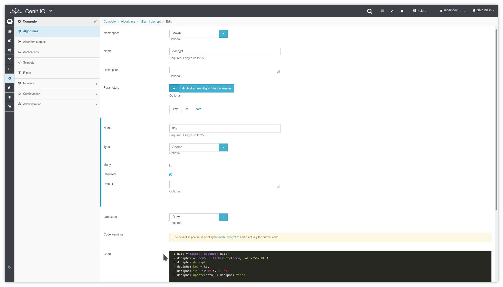

# Create decrypt algorithm in CenitIO

## Requirements

* Identify the input data, the purpose and the output data.
* Review Ruby OpenSSL::Cipher documentation.[<i class="fa fa-external-link" aria-hidden="true"></i>](https://ruby-doc.org/stdlib-2.4.0/libdoc/openssl/rdoc/OpenSSL/Cipher.html)
* Sign in at CenitIO.[<i class="fa fa-external-link" aria-hidden="true"></i>](https://cenit.io/users/sign_in)

## Creating the algorithm

* Goto [algorithms](https://cenit.io/algorithm) module.
* Select the action [add new](https://cenit.io/algorithm/new) to create the new algorithm.
* Complete the form fields with the information corresponding to the algorithm in question.

    >- **Namespace**: Miesh
    >- **Name**: decrypt
    >- **Parameters**: key, iv, data
    >- **Language**: Ruby
    >- **Code**: Code snippet written in the Ruby language to decrypt a data buffer.

    > **Note**: The algorithms that are not specific to some integration, it is recommended to define them under a common namespace for all integrations.

## Code snippet

```ruby
data = Base64::decode64(data)
decipher = OpenSSL::Cipher.try(:new, 'AES-256-CBC')
decipher.decrypt
decipher.key = key
decipher.iv = iv if iv != nil
decipher.update(data) + decipher.final
```

## Snapshots of the process

### Goto algorithm module

   
    
### Add new algorithm

   
   
