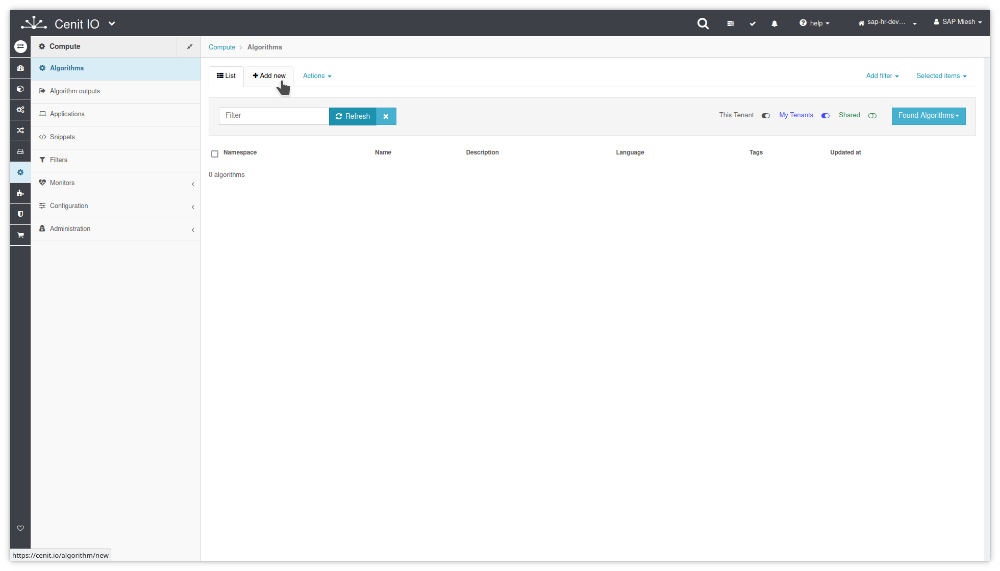
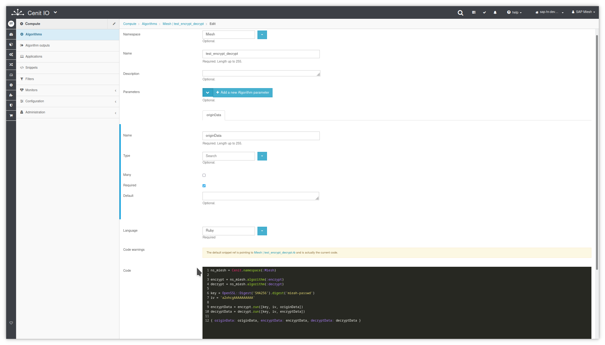
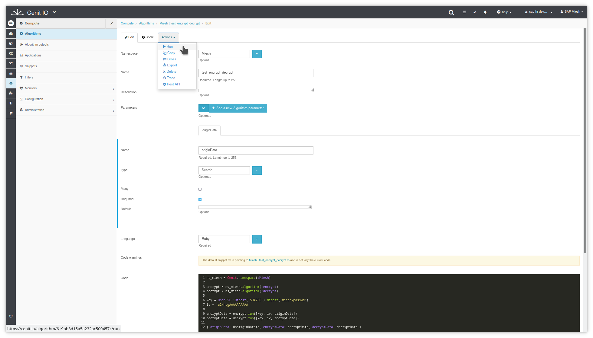
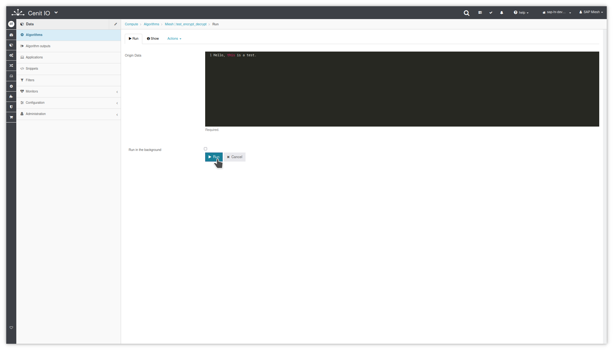
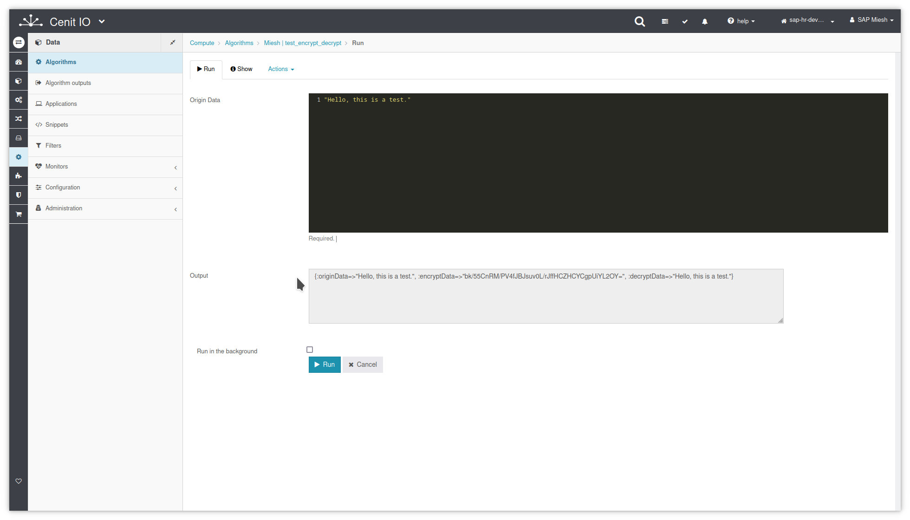

# Create test encrypt and decrypt algorithm in CenitIO

## Requirements

* Identify the input data, the purpose and the output data.
* [Algorithm to Encrypt](algorithms/miesh-encrypt.md)
* [Algorithm to Decrypt](algorithms/miesh-decrypt.md)
* Sign in at CenitIO.[<i class="fa fa-external-link" aria-hidden="true"></i>](https://cenit.io/users/sign_in)

## Creating the algorithm

* Goto [algorithms](https://cenit.io/algorithm) module.
* Select the action [add new](https://cenit.io/algorithm/new) to create the new algorithm.
* Complete the form fields with the information corresponding to the algorithm in question.
   
    >- **Namespace**: Miesh
    >- **Name**: test_encrypt_decrypt
    >- **Parameters**: data
    >- **Language**: Ruby
    >- **Code**: Code snippet written in the Ruby language to test encrypt and decrypt a data buffer.

    > **Note**: The algorithms that are not specific to some integration, it is recommended to define them under a common namespace for all integrations.

## Code snippet

```ruby
ns_miesh = Cenit.namespace(:Miesh)

encrypt = ns_miesh.algorithm(:encrypt)
decrypt = ns_miesh.algorithm(:decrypt)

key = OpenSSL::Digest('SHA256').digest('mieah-passwd')
iv = 'a2xhcgAAAAAAAAAA'

encryptData = encrypt.run([key, iv, originData])
decryptData = decrypt.run([key, iv, encryptData])

{ originData: originData, encryptData: encryptData, decryptData: decryptData }
```

## Snapshots of the process

### Goto algorithm module

   
    
### Add new algorithm

   
   
   
### Run the algorithm   
   
   
   
   