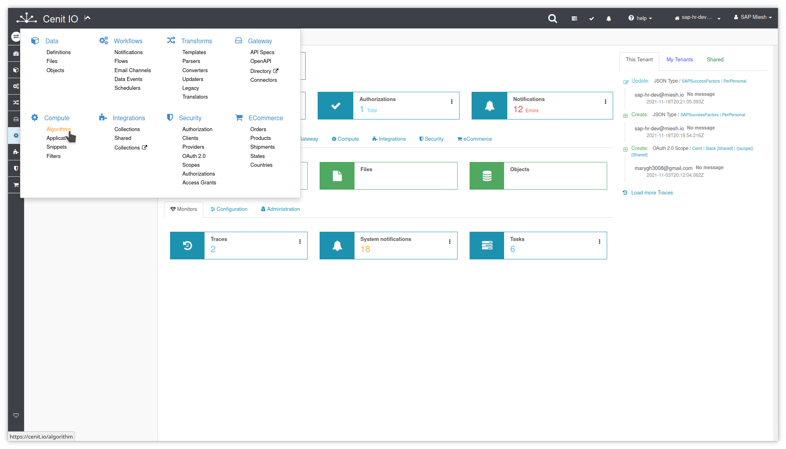
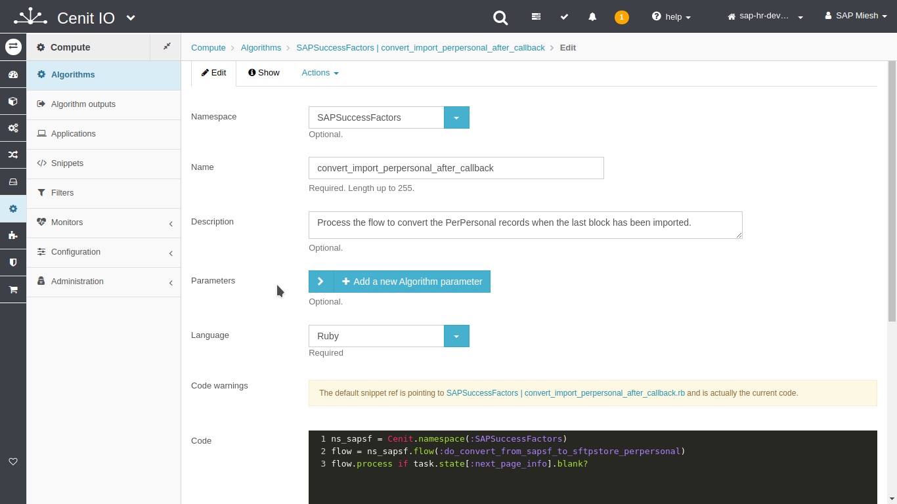

# Create callback algorithm to start convert flow after imported from api SAP-SuccessFactors

## Requirements
* Identify the input data, the purpose and the output data.[<i class="fa fa-external-link" aria-hidden="true"></i>](https://cenit-io.github.io/docs/#/algorithms?id=algorithm39s-attributes)
* Identify when the import finishes and the conversion process starts.
* Sign in at CenitIO.[<i class="fa fa-external-link" aria-hidden="true"></i>](https://cenit.io/users/sign_in)

## Creating the algorithm

* Goto [algorithms](https://cenit.io/algorithm) module.
* Select the action [add new](https://cenit.io/algorithm/new) to create the new algorithm.
* Complete the form fields with the information corresponding to the algorithm in question.

    >- **Namespace**: SAPSuccessFactors
    >- **Name**: convert_import_perpersonal_after_callback
    >- **Parameters**: task
    >- **Language**: Ruby
    >- **Code**: Code snippet written in the Ruby language.

    > **Note**: For the name of the algorithms after_callback, the following format is recommended **{*purpose_action*}\_{*flow_type*}\_{*purpose_noun*}_after_callback**

## Code snippet

Start [conversion flow](flows/do_convert_from_sapsf_to_sftpstore_perpersonal.md) when import is finished

```ruby
ns_sapsf = Cenit.namespace(:SAPSuccessFactors)
flow = ns_sapsf.flow(:do_convert_from_sapsf_to_sftpstore_perpersonal)
flow.process if task.state[:next_page_info].blank?
```

## Snapshots of the process

### Goto algorithm module

   
    
### Add new algorithm

   
   
