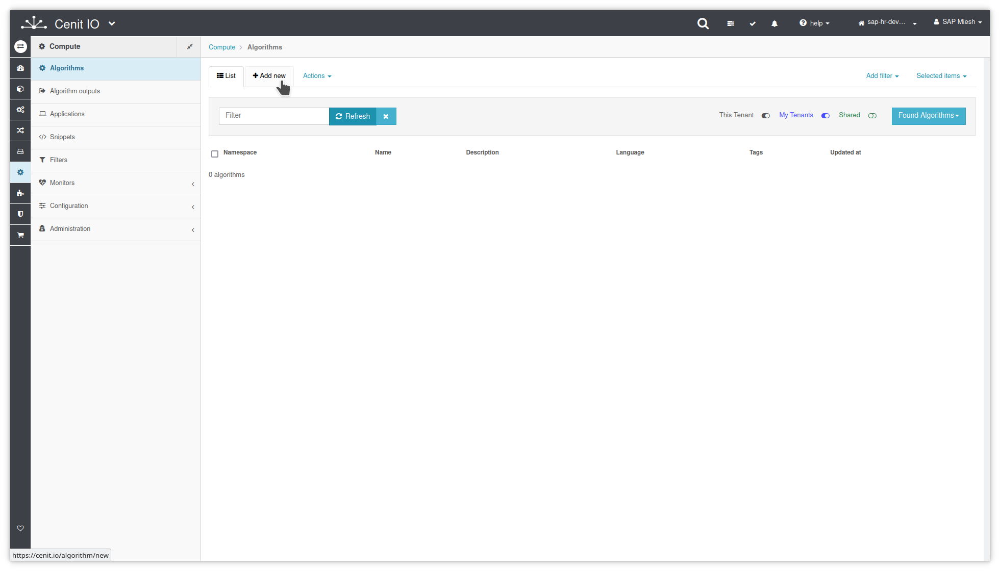

# Create get_jsessionid algorithm

## Requirements

* Identify the input data, the purpose and the output data.
* Review Ruby Nokogiri::XML documentation.
* Sign in at CenitIO.[<i class="fa fa-external-link" aria-hidden="true"></i>](https://cenit.io/users/sign_in)

## Creating the algorithm

* Goto [algorithms](https://cenit.io/algorithm) module.
* Select the action [add new](https://cenit.io/algorithm/new) to create the new algorithm.
* Complete the form fields with the information corresponding to the algorithm in question.

    >- **Namespace**: SAPSuccessFactors
    >- **Name**: get_jsessionid
    >- **Language**: Ruby
    >- **Code**: Code fragment written in Ruby language to submit the login webhook and get the jsessionid from the response xml.

    > **Note**: The algorithms that are not specific to some integration, it is recommended to define them under a common namespace for all integrations.

## Code snippet

```ruby
ns_sapsf = Cenit.namespace(:SAPSuccessFactors)

connection = ns_sapsf.connection('connection-sfapi')
webhook = ns_sapsf.webhook(:login).with(connection)
template_parameters = connection.template_parameters_hash

username, company_id = template_parameters['username'].split('@')
password = template_parameters['password']

body = begin
  builder = Nokogiri::XML::Builder.new_builder

  builder[:soapenv].Envelope('xmlns:soapenv' => 'http://schemas.xmlsoap.org/soap/envelope/', 'xmlns:urn' => 'urn:sfobject.sfapi.successfactors.com') {
    builder[:soapenv].Header
    builder[:soapenv].Body {
      builder[:urn].login {
        builder[:urn].credential {
          builder[:urn].companyId(company_id)
          builder[:urn].username(username)
          builder[:urn].password(password)
        }
      }
    }
  }

  builder.to_xml(encoding: 'UTF-8')
end

response = webhook.submit!(body: body)

xml = Nokogiri::XML(response) { |config| config.strict.noblanks }
xml.at_xpath('//ns1:sessionId', 'ns1' => 'urn:sfobject.sfapi.successfactors.com').content
```

## Snapshots of the process

### Goto algorithm module

   
    
### Add new algorithm

   
   
