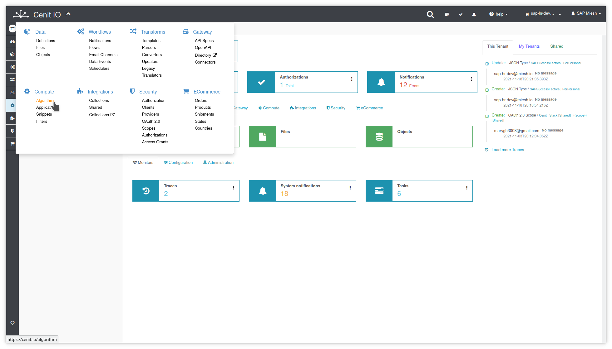
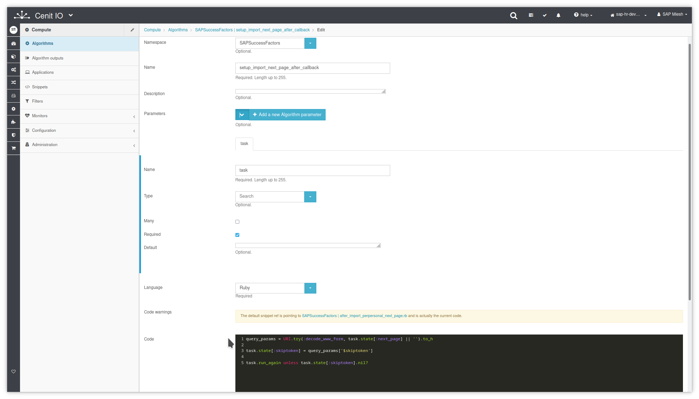

# Create setup_import_next_page_after_callback algorithm

## Requirements

* Identify the input data, the purpose and the output data.[<i class="fa fa-external-link" aria-hidden="true"></i>](https://cenit-io.github.io/docs/#/algorithms?id=algorithm39s-attributes)
* Identify the pagination strategy.[<i class="fa fa-external-link" aria-hidden="true"></i>](https://help.sap.com/viewer/d599f15995d348a1b45ba5603e2aba9b/2111/en-US/5c8bca0af1654b05a83193b2922dcee2.html)
* Sign in at CenitIO.[<i class="fa fa-external-link" aria-hidden="true"></i>](https://cenit.io/users/sign_in)

## Creating the algorithm

* Goto [algorithms](https://cenit.io/algorithm) module.
* Select the action [add new](https://cenit.io/algorithm/new) to create the new algorithm.
* Complete the form fields with the information corresponding to the algorithm in question.

    >- **Namespace**: SAPSuccessFactors
    >- **Name**: setup_import_next_page_after_callback
    >- **Parameters**: task
    >- **Language**: Ruby
    >- **Code**: Code snippet written in the Ruby language.

    > **Note**: For the name of the algorithms after_callback, the following format is recommended **{*purpose_action*}\_{*flow_type*}\_{*purpose_noun*}_after_callback**

## Code snippet

Set the skiptoken task-state with the reference value to the next page, to be used later in the [before-submit](algorithms/sapsf-setup_import_before_submit.md).

```ruby
query_params = URI.try(:decode_www_form, task.state[:next_page] || '').to_h

task.state[:skiptoken] = query_params['$skiptoken']

task.run_again unless task.state[:skiptoken].nil?
```

## Snapshots of the process

### Goto algorithm module

   
    
### Add new algorithm

   
   
