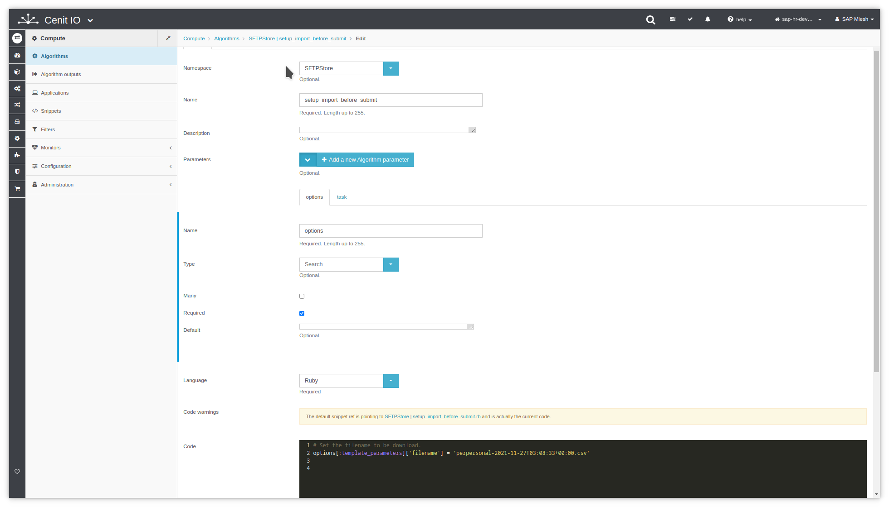

# Create an algorithm to setup the import request before submitting it

## Requirements

* Identify the input data, the purpose and the output data.[<i class="fa fa-external-link" aria-hidden="true"></i>](https://cenit-io.github.io/docs/#/algorithms?id=algorithm39s-attributes)
* Identify the filename that to be downloaded.
* Sign in at CenitIO.[<i class="fa fa-external-link" aria-hidden="true"></i>](https://cenit.io/users/sign_in)

## Creating the algorithm

* Goto [algorithms](https://cenit.io/algorithm) module.
* Select the action [add new](https://cenit.io/algorithm/new) to create the new algorithm.
* Complete the form fields with the information corresponding to the algorithm in question.

    >- **Namespace**: SFTPStore
    >- **Name**: setup_import_before_submit
    >- **Parameters**: options, task
    >- **Language**: Ruby
    >- **Code**: Code snippet written in the Ruby language.

    > **Note**: For the name of the algorithms before_submit, the following format is recommended **setup_{*flow_type*}_{*resource*}_before_submit** or **setup_{*flow_type*}_before_submit** when the same algorithm can be applied in several flows of the same type but over different resources.

## Code snippet

```ruby
# Set the filename to be download.
options[:template_parameters]['filename'] = 'perpersonal-2021-11-27T03:08:33+00:00.csv'
```

## Snapshots of the process

### Goto algorithm module

   
    
### Add new algorithm

   
   
