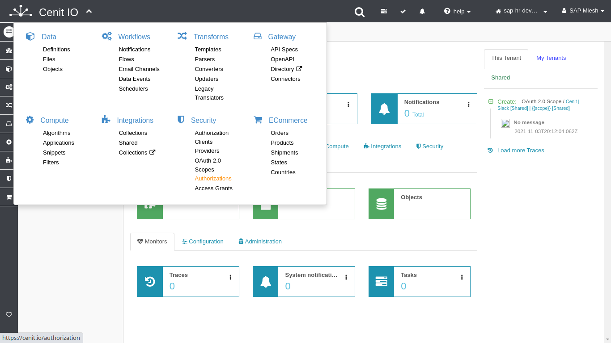
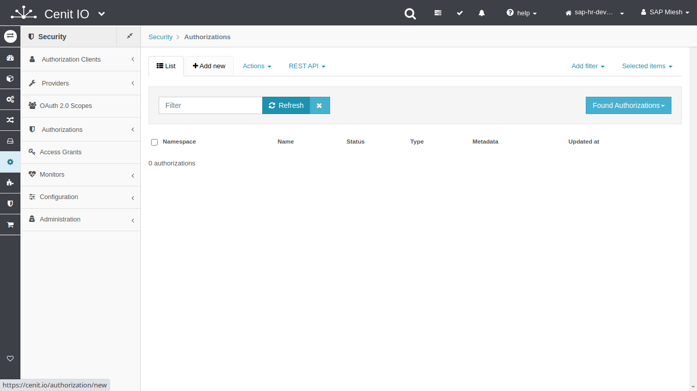
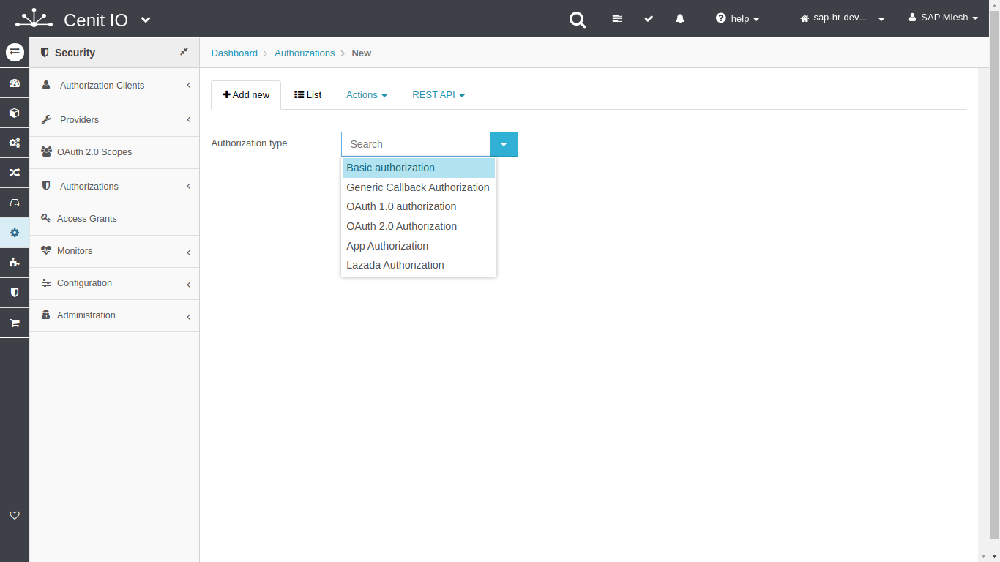
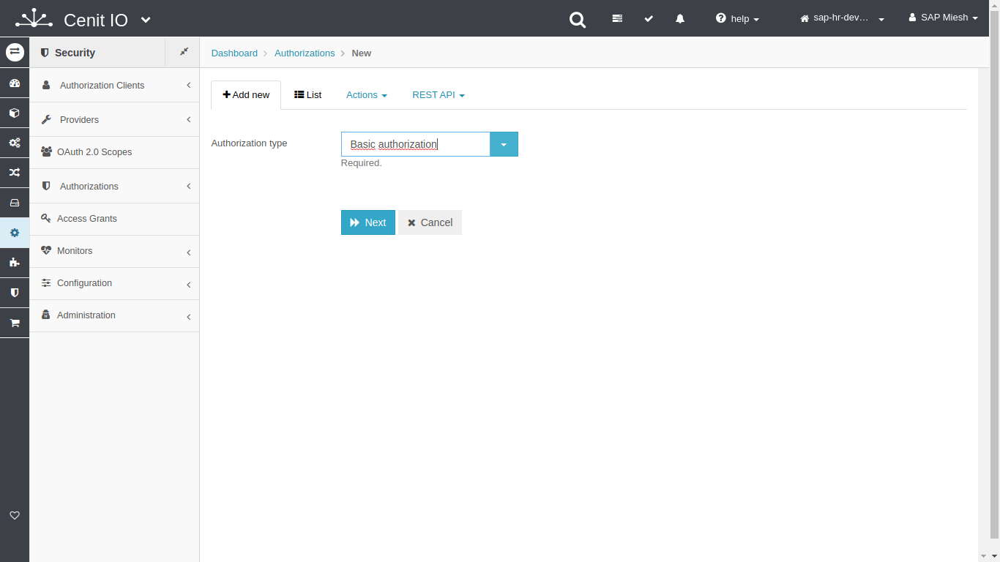
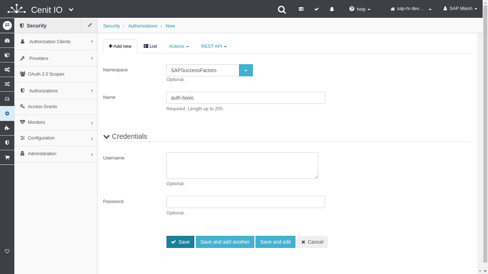
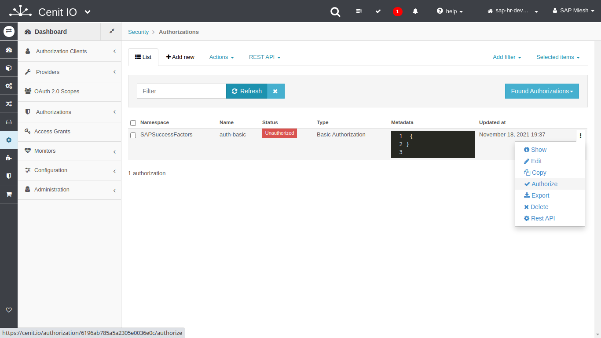
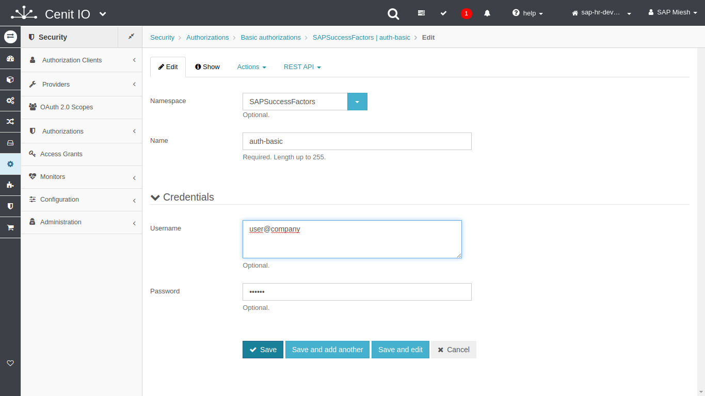
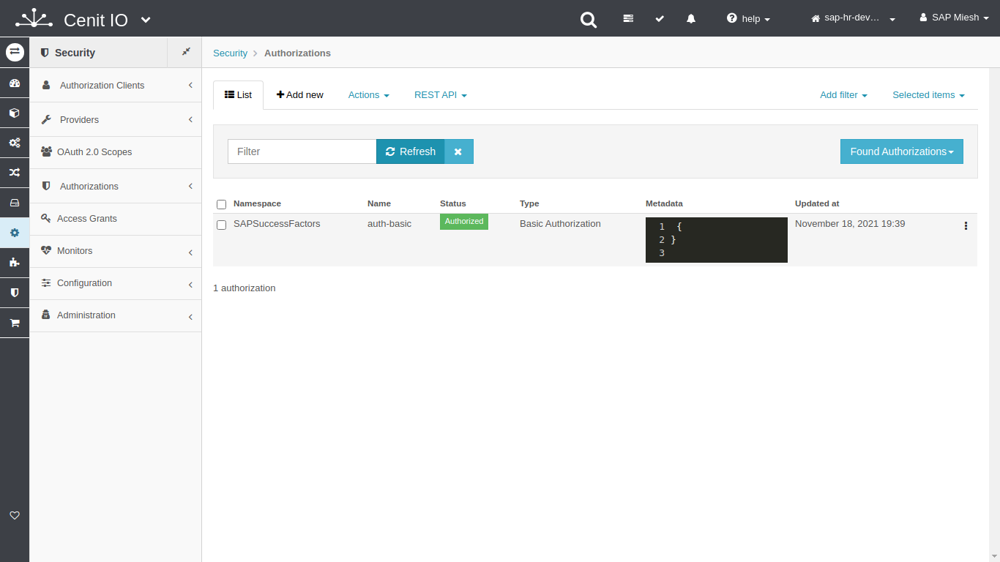

# Create SAP-SuccessFactors authorizations in CenitIO

## Requirements

* SAP-SuccessFactors user credentials. (_user-name, company-id and password_)
* Review the SAP-SuccessFactors API specification.[<i class="fa fa-external-link" aria-hidden="true"></i>](https://help.sap.com/viewer/368c481cd6954bdfa5d0435479fd4eaf/Cloud/en-US/bd2fbd5133e8411b8e3608fceb28a608.html)
* Get authorization endpoint.
* Sign in at CenitIO.[<i class="fa fa-external-link" aria-hidden="true"></i>](https://cenit.io/users/sign_in)

## Creating Basic Authorization

* Goto [authorizations](https://cenit.io/authorization) module or direct to [basic-authorizations](https://cenit.io/basic_authorization) module.
* Select the action [add new](https://cenit.io/basic_authorization/new) to create the new authorization.
* Complete the fields of the form with the following information or those corresponding to your business:

    >- **Namespace**: SAP-SuccessFactors
    >- **Name**: miesh-basic-auth
    >- **Username**: your-user-name@your-comapany-id
    >- **Password**: your-password

## Snapshots of the process

### Goto authorization module

   
   
    
### Add new authorization

   
   
   
   
### Authorize
   
   
   
   
