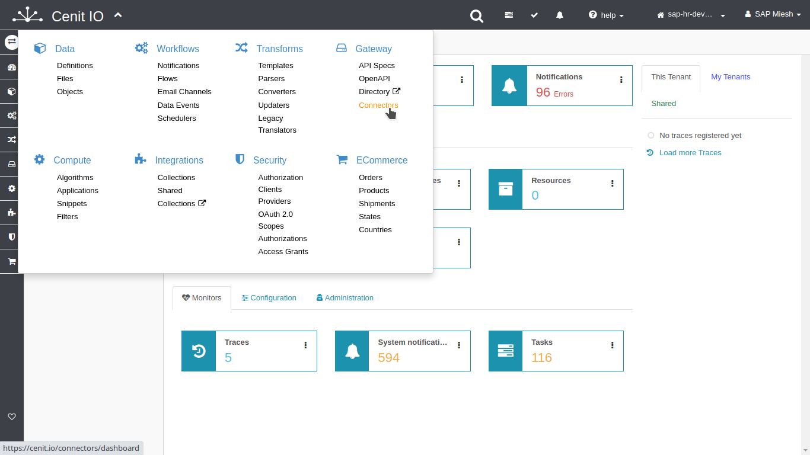
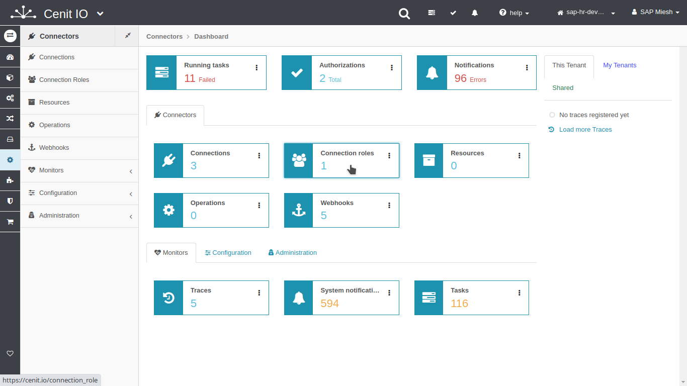
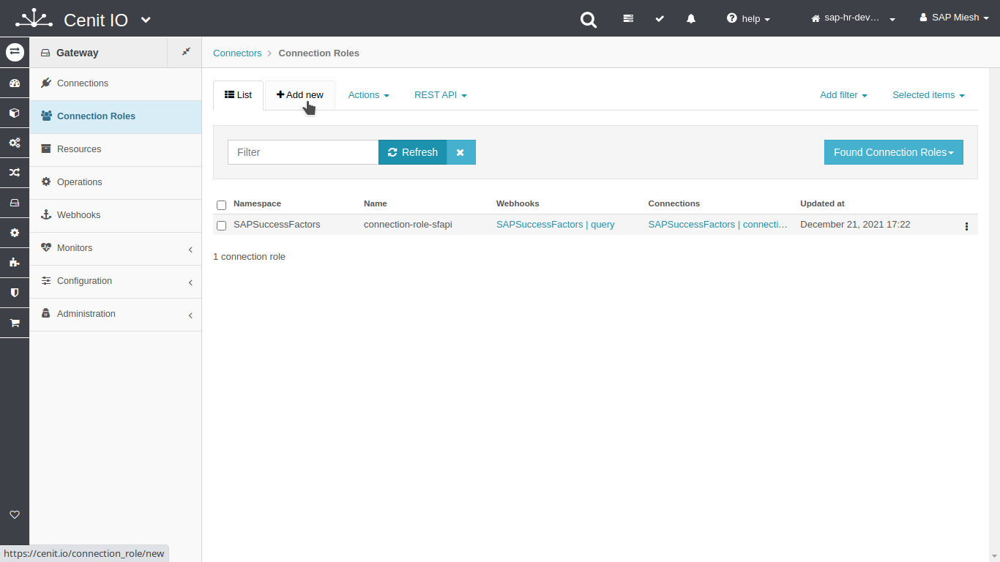
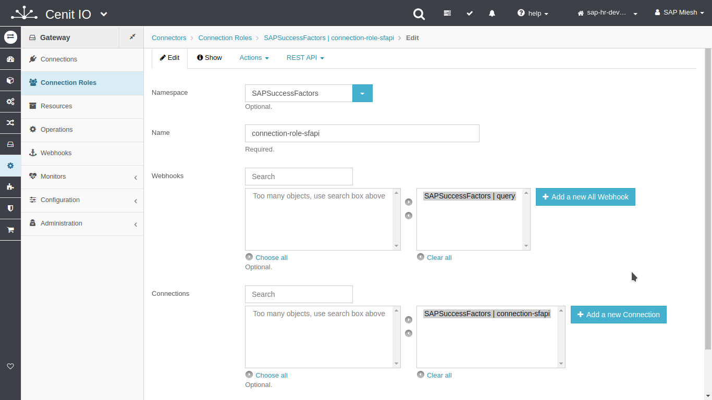
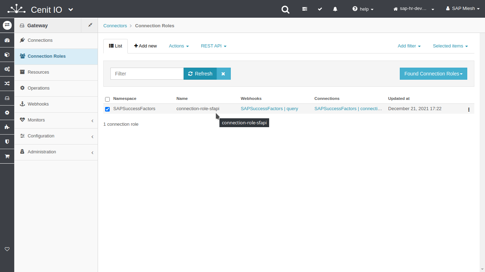

# Create SAPSuccessFactors connection roles

## Requirements

* SAPSuccessFactors sfapi webhooks.
* SAPSuccessFactors sfapi connections.
* Sign in at CenitIO.[<i class="fa fa-external-link" aria-hidden="true"></i>](https://cenit.io/users/sign_in)

## Creating connection role

* Goto [connection roles](https://cenit.io/connection_role) module.
* Select the action [add new](https://cenit.io/connection_role/new) to create the new connection role.
* Complete the fields of the form with the following information or those corresponding to your business:

    >- **Namespace**: SAPSuccessFactors
    >- **Name**: connection-role-sfapi
    >- **Webhooks**:
    >   - [SAPSuccessFactors | ](webhooks/)
    >- **Connections**: 
    >   - [SAPSuccessFactors |connection-sfapi](connections/SAPSuccessFactors-connection_sfapi.md)    

    > **Note**: For the name of the connection, the following format is recommended **connection\-role\-{*particular identifier*\}** or **connection-role** for the default connection role. 

## Snapshots of the process

### Goto connection module

   
   
   
    
### Add new connection

   
   
