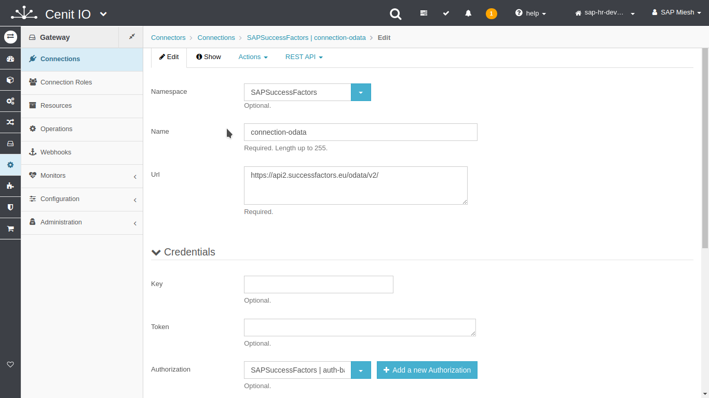
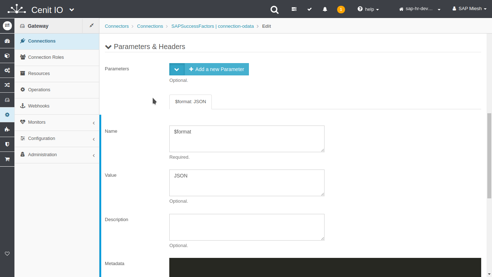

# Create SAPSuccessFactors connections

## Requirements

* SAPSuccessFactors [authorization](authorizations/SAPSuccessFactors-auth_basic.md)
* Review the SAPSuccessFactors Employee Central OData API specification.[<i class="fa fa-external-link" aria-hidden="true"></i>](https://help.sap.com/viewer/d599f15995d348a1b45ba5603e2aba9b/2111/en-US/5c8bca0af1654b05a83193b2922dcee2.html)
* The Base-Url of API-Services.
* Sign in at CenitIO.[<i class="fa fa-external-link" aria-hidden="true"></i>](https://cenit.io/users/sign_in)

## Creating connection

* Goto [connections](https://cenit.io/connection) module.
* Select the action [add new](https://cenit.io/connection/new) to create the new connection.
* Complete the fields of the form with the following information or those corresponding to your business:

    >- **Namespace**: SAPSuccessFactors
    >- **Name**: connection-odata
    >- **Url**: https://api2.successfactors.eu/odata/v2/
    >- **Authorization**: SAPSuccessFactors | auth-basic
    >- **Parameters**: $format = JSON
    
    > **Note**: For the name of the connection, the following format is recommended **connection\-\{*particular identifier*\}** or **connection** for the default connection. 

## Snapshots of the process

### Goto connection module

   
   
   
    
### Add new connection

   
   
   
   
