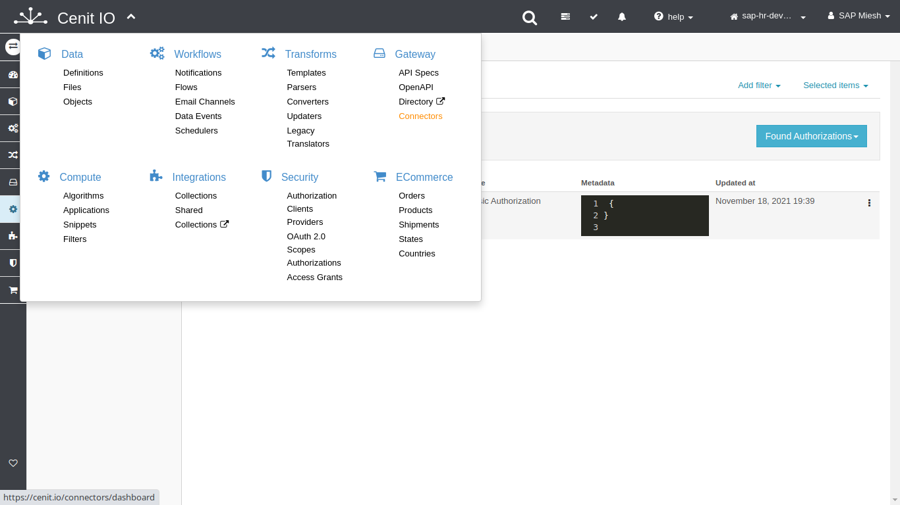
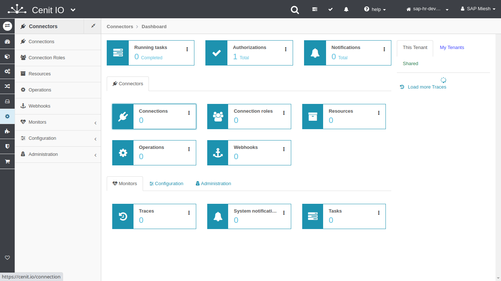
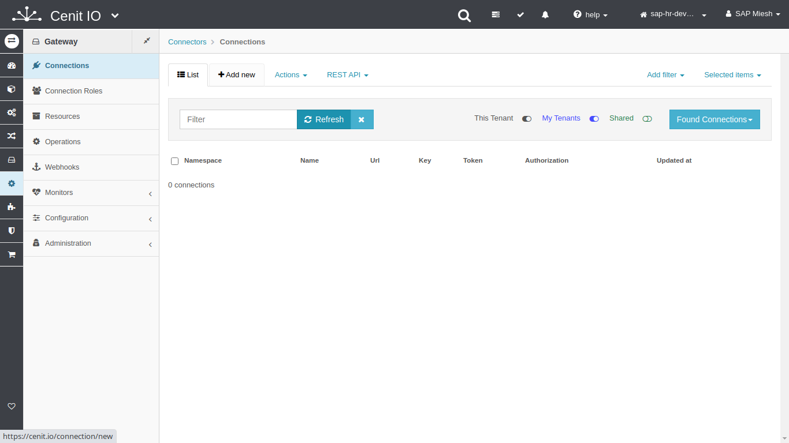

# Create SAP-SuccessFactors connections in CenitIO

## Requirements

* SAP-SuccessFactors [authorization](../authorizations/sap-success-factors.md)
* Review the SAP-SuccessFactors API specification.[<i class="fa fa-external-link" aria-hidden="true"></i>](https://help.sap.com/viewer/368c481cd6954bdfa5d0435479fd4eaf/Cloud/en-US/bd2fbd5133e8411b8e3608fceb28a608.html)
* The Base-Url of API-Services.
* Sign in at CenitIO.[<i class="fa fa-external-link" aria-hidden="true"></i>](https://cenit.io/users/sign_in)

## Creating connection

* Goto [connections](https://cenit.io/connection) module.
* Select the action [add new](https://cenit.io/connection/new) to create the new connection.
* Complete the fields of the form with the following information or those corresponding to your business:

    >- **Namespace**: SAPSuccessFactors
    >- **Name**: connection
    >- **Url**: https://api2.successfactors.eu/odata/v2/
    >- **Authorization**: SAPSuccessFactors | auth-basic

## Snapshots of the process

### Goto connection module

   
   
   
    
### Add new connection

   
   
   
   
