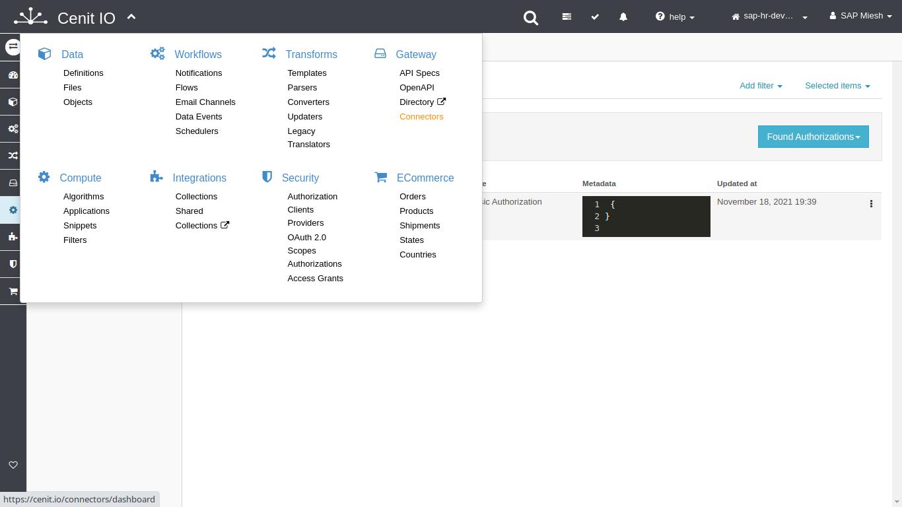
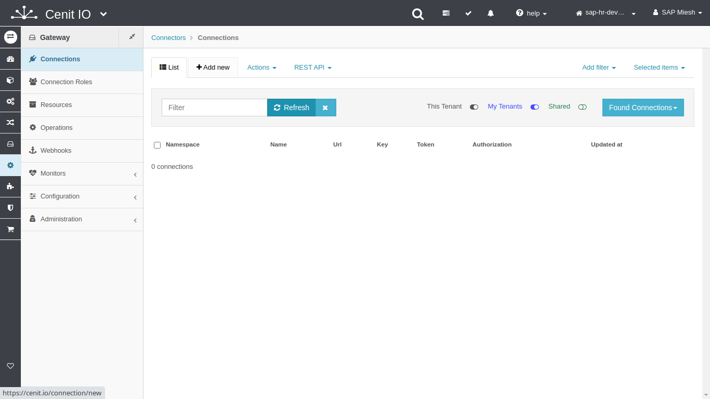
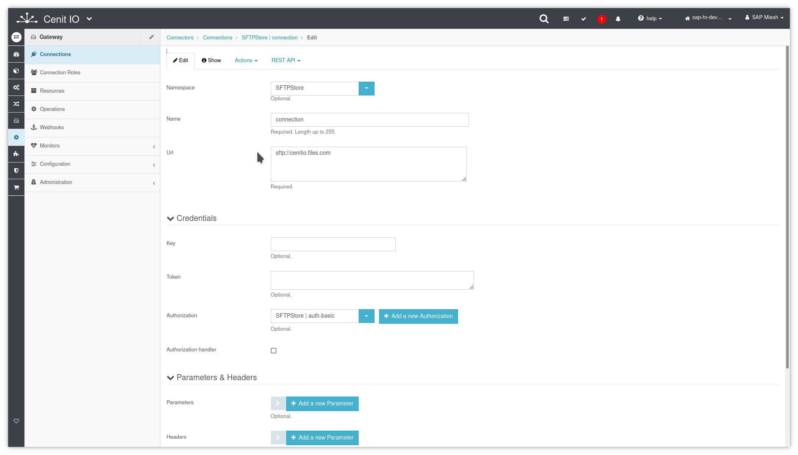
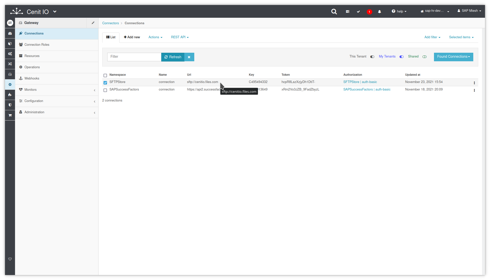

# Create SFTP-Store connections in CenitIO

## Requirements

* SFTP-Store [authorization](../authorizations/sftp-store.md)
* The Base-Url of SFTP-Store.
* Sign in at CenitIO.[<i class="fa fa-external-link" aria-hidden="true"></i>](https://cenit.io/users/sign_in)

## Creating connection

* Goto [connections](https://cenit.io/connection) module.
* Select the action [add new](https://cenit.io/connection/new) to create the new connection.
* Complete the fields of the form with the following information or those corresponding to your business:

    >- **Namespace**: SFTPStore
    >- **Name**: connection
    >- **Url**: sftp://cenitio.files.com
    >- **Authorization**: SFTPStore | auth-basic

## Snapshots of the process

### Goto connection module

   
   
   
    
### Add new connection

   
   
   
