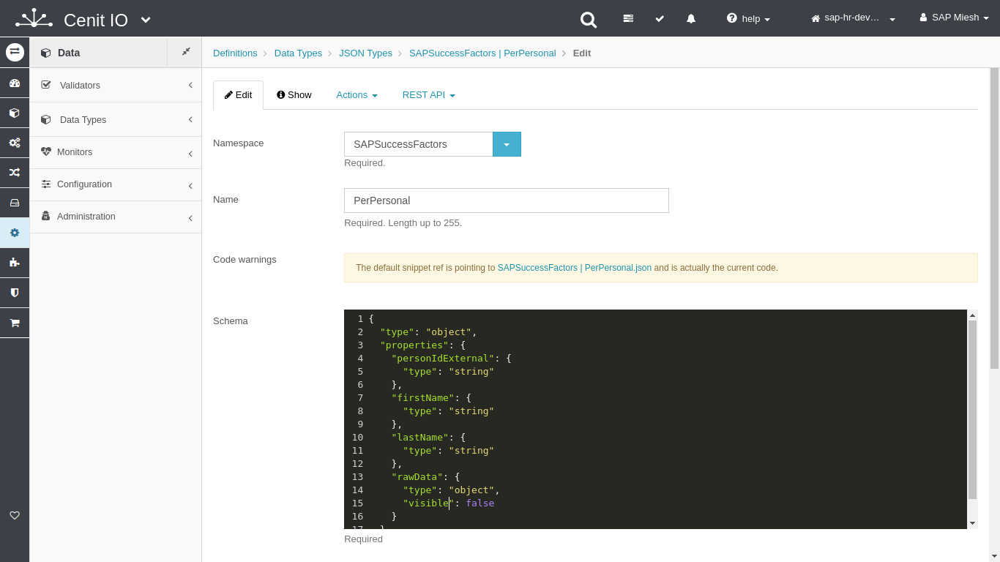

# Create SAPSuccessFactors PerPersonal data-type

## Requirements

* Review the SAPSuccessFactors API specification.[<i class="fa fa-external-link" aria-hidden="true"></i>](https://help.sap.com/viewer/d599f15995d348a1b45ba5603e2aba9b/2111/en-US/5c8bca0af1654b05a83193b2922dcee2.html)
* The resource schema in the API-Service response.
* Sign in at CenitIO.[<i class="fa fa-external-link" aria-hidden="true"></i>](https://cenit.io/users/sign_in)

## Creating data-type

* Goto [data-types](https://cenit.io/json_data_type) module.
* Select the action [add new](https://cenit.io/json_data_type/new) to create the new data-type.
* Complete the fields of the form with the following information or those corresponding to your business:

    >- **Namespace**: SAPSuccessFactors
    >- **Name**: PerPersonal
    >- **Schema**: { ...[JSON Schema](https://json-schema.org/)... }
    >- **Discard additional properties**: true

    > **Note**: In schema you can define the main attrs and a rawData attr of type object to store all the information of the resource.

## Schema snippet

```json
{
  "type": "object",
  "properties": {
    "personIdExternal": {
      "type": "string"
    },
    "firstName": {
      "type": "string"
    },
    "lastName": {
      "type": "string"
    },
    "rawData": {
      "type": "object",
      "visible": false
    }
  }
}
```

## Snapshots of the process

### Goto data-type module

   
   
   
    
### Add new data-type

   
   
### View records

   
