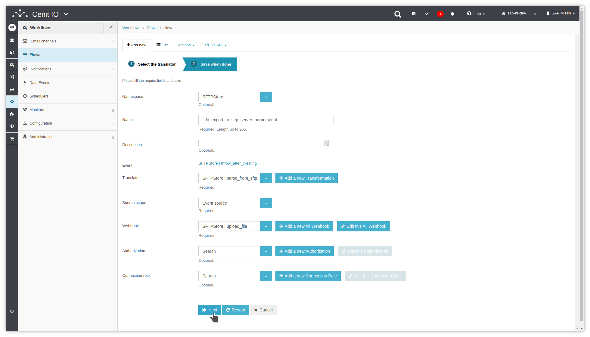
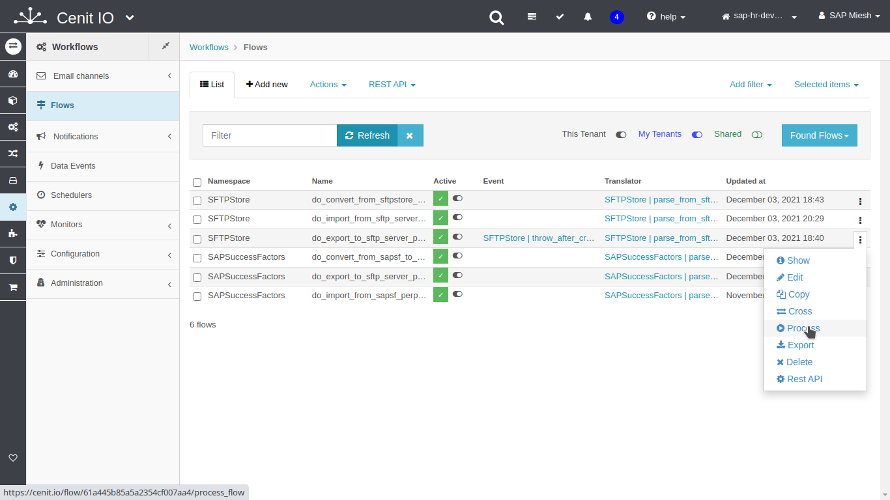

# Create flow to export PerPersonal record to SFTPStore CSV file

## Requirements

* SFTPStore [authorization](../authorizations/SFTPStore-auth_basic.md)
* SFTPStore [webhook](../webhooks/SFTPStore-upload_file.md)
* SFTPStore [translator](translators/parse_from_sftpstore_perpersonal_to_sftp_server_upload_request.md)
* SFTPStore [data-event](observers/SFTPStore-PerPersonal-throw_after_creating.md)
* Sign in at CenitIO.[<i class="fa fa-external-link" aria-hidden="true"></i>](https://cenit.io/users/sign_in)

## Creating flow

* Goto [flows](https://cenit.io/flow) module.
* Select the action [add new](https://cenit.io/flow/new) to create the new flow.
* Complete the fields of the form with the following information or those corresponding to your business:

    >- **Namespace**: SFTPStore
    >- **Name**: do_export_to_sftp_server_perpersonal
    >- **Description**: Export the consolidated record of the PerPersonal entity from the SFTPStore to an SFTP Server.
    >- **Event**: [SFTPStore | throw_after_creating](observers/SFTPStore-PerPersonal-throw_after_creating.md)
    >- **Translator**: [SFTPStore | parse_from_sftpstore_perpersonal_to_sftp_server_upload_request](translators/parse_from_sftpstore_perpersonal_to_sftp_server_upload_request.md)
    >- **Source scope**: Event source
    >- **Webhook**: [SFTPStore | upload_file](../webhooks/SFTPStore-upload_file.md)
    >- **Active**: true
    >- **Notify request**: true
    >- **Notify response**: true

    > **Note**: For the name of the export flow, the following format is recommended **do_export_to_\{*destination*\}**

## Snapshots of the process

### Goto flow module

   
   
    
### Add new flow

   
   
   
   
   
   
### Test flow (process)

   
   
