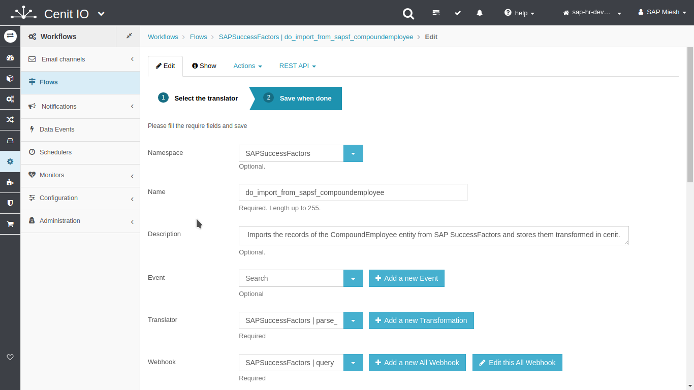
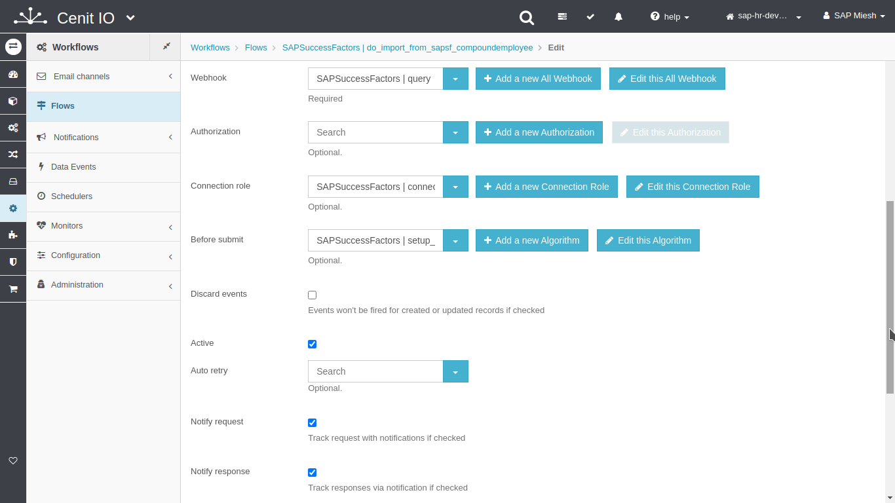
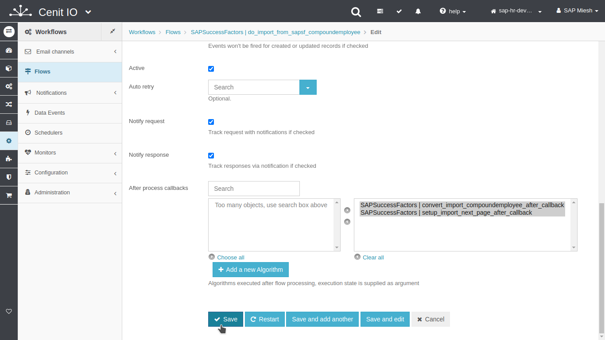
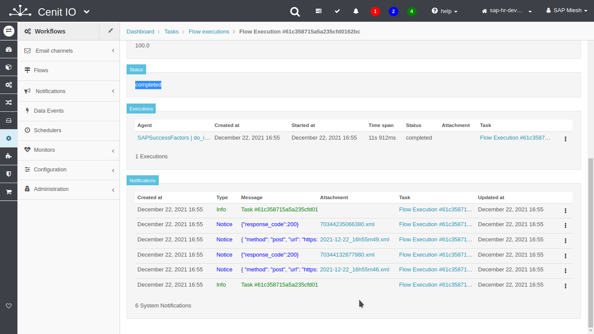
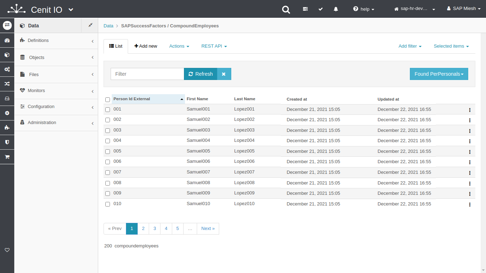

# Create flow to import CompoundEmployees from SAPSuccessFactors

## Requirements

* SAPSuccessFactors [webhook](webhooks/SAPSuccessFactors-query.md)
* SAPSuccessFactors [connection-role](connection-roles/SAPSuccessFactors-connection_sfapi.md)
* SAPSuccessFactors [translator](translators/parse_from_sapsf_api_response_to_sapsf_compoundemployees.md)
* SAPSuccessFactors [before-submit](algorithms/sapsf-setup_import_compoundemployees_before_submit.md)
* SAPSuccessFactors [after-callback](algorithms/sapsf-convert_import_perpersonal_after_callback.md)
* Sign in at CenitIO.[<i class="fa fa-external-link" aria-hidden="true"></i>](https://cenit.io/users/sign_in)

## Creating flow

* Goto [flows](https://cenit.io/flow) module.
* Select the action [add new](https://cenit.io/flow/new) to create the new flow.
* Complete the fields of the form with the following information or those corresponding to your business:

    >- **Namespace**: SAPSuccessFactors
    >- **Name**: do_import_from_sapsf_compoundemployees
    >- **Description**: Imports the records of the CompoundEmployee entity from SAP SuccessFactors and stores them transformed in cenit.
    >- **Translator**: [SAPSuccessFactors | parse_from_sapsf_api_response_to_sapsf_compoundemployees](translators/parse_from_sapsf_api_response_to_sapsf_compoundemployees.md)
    >- **Webhook**: [SAPSuccessFactors | query](webhooks/SAPSuccessFactors-query.md)
    >- **Connection role**: [SAPSuccessFactors | connection-role-sfapi](connection-roles/SAPSuccessFactors-connection_sfapi.md)
    >- **Before submit**: 
    >   - [SAPSuccessFactors | setup_import_compoundemployees_before_submit](algorithms/sapsf-setup_import_compoundemployees_before_submit.md)
    >- **After process callbacks**: 
    >   - [SAPSuccessFactors | setup_import_next_page_after_callback](../algorithms/sapsf-setup_import_next_page_after_callback.md)
    >   - [SAPSuccessFactors | convert_import_compoundemployees_after_callback](algorithms/sapsf-convert_import_compoundemployees_after_callback.md)
    >- **Active**: true
    >- **Notify request**: true
    >- **Notify response**: true

> **Note**: For the name of the import flow, the following format is recommended **do_import_from\_\{*origin*\}**

## Snapshots of the process

### Goto flow module

   
   
    
### Add new flow

   
   
   
   
### Test flow (process)

   
   
   
   
   
   
