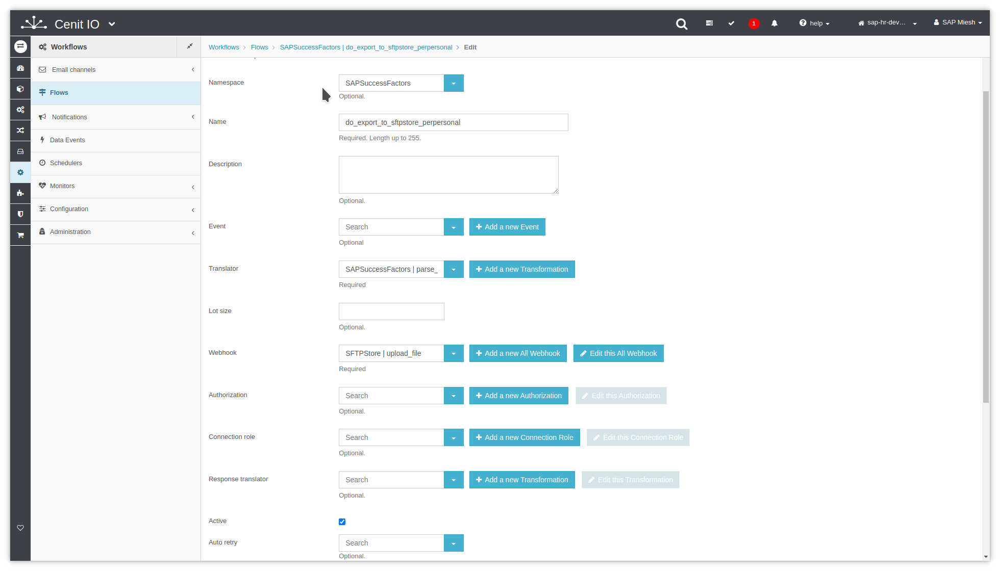
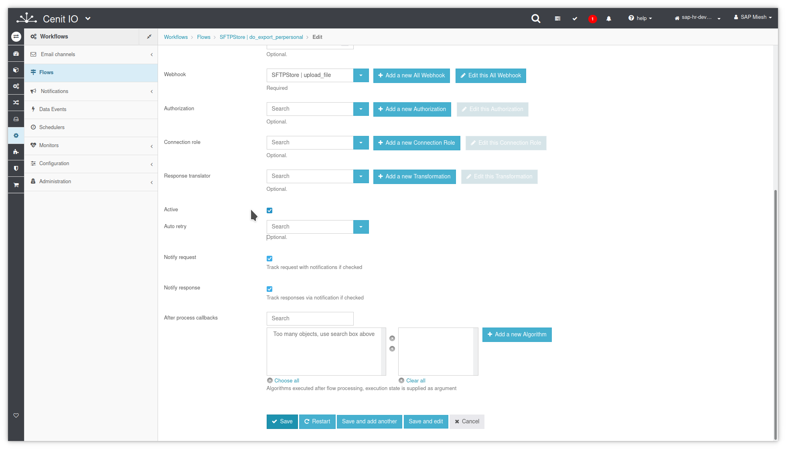
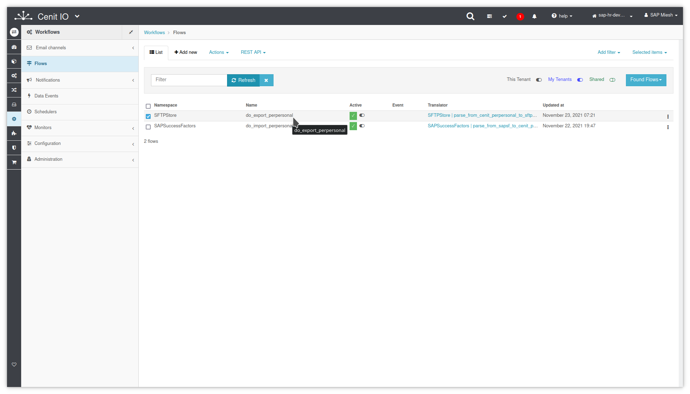
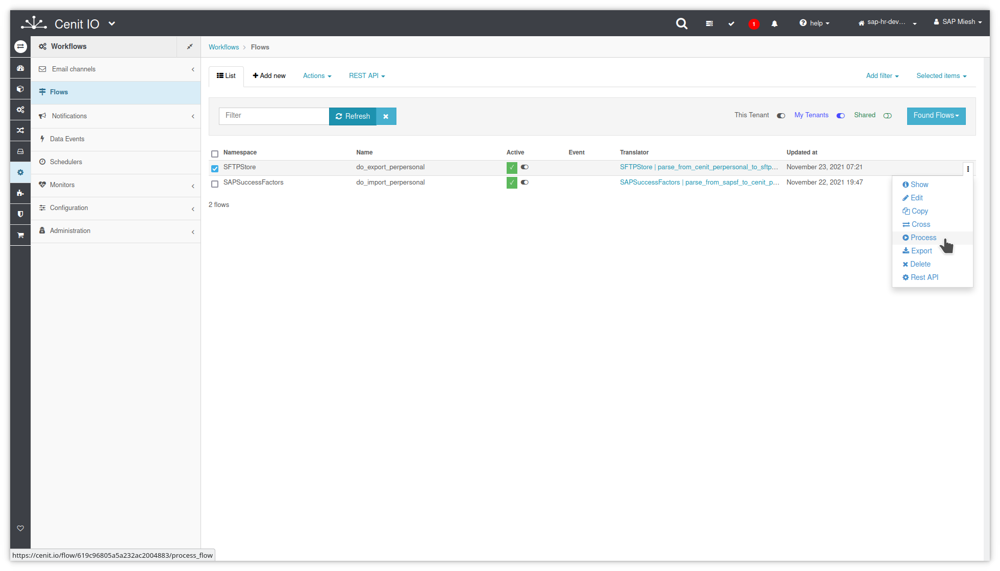
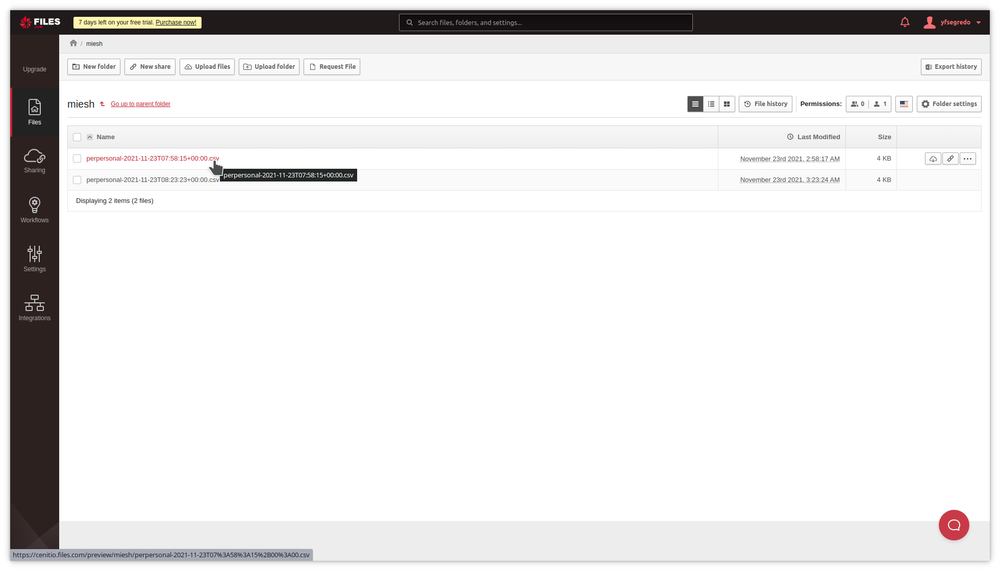

# Create flow to export PerPersonal records to SFTPStore CSV file

## Requirements

* SFTPStore [authorization](../authorizations/sftp-store.md)
* SFTPStore [webhook](../webhooks/sftp-store-upload-file.md)
* SFTPStore [translator](../translators/parse_from_sapsf_perpersonal_to_sftp_server_upload_request.md)
* Sign in at CenitIO.[<i class="fa fa-external-link" aria-hidden="true"></i>](https://cenit.io/users/sign_in)

## Creating flow

* Goto [flows](https://cenit.io/flow) module.
* Select the action [add new](https://cenit.io/flow/new) to create the new flow.
* Complete the fields of the form with the following information or those corresponding to your business:

    >- **Namespace**: SAPSuccessFactors
    >- **Name**: do_export_to_sftp_server_perpersonal
    >- **Description**: Export the records of the PerPersonal entity from Cenit to CSV file.
    >- **Translator**: SFTPStore | parse_from_cenit_perpersonal_to_sftp_csv
    >- **Webhook**: SFTPStore | upload_file
    >- **Active**: true
    >- **Notify request**: true
    >- **Notify response**: true

    > **Note**: For the name of the export flow, the following format is recommended **do_export_to_\{*destination*\}**

## Snapshots of the process

### Goto flow module

   
   
    
### Add new flow

   
   
   
### Test flow (process)

   
   
   
