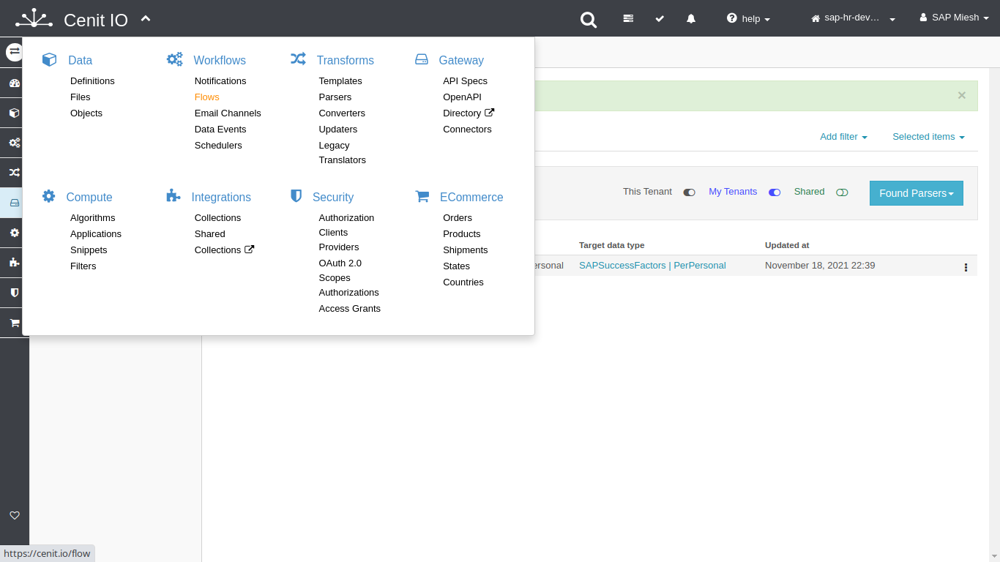
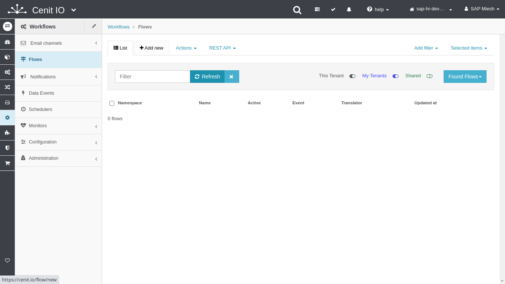
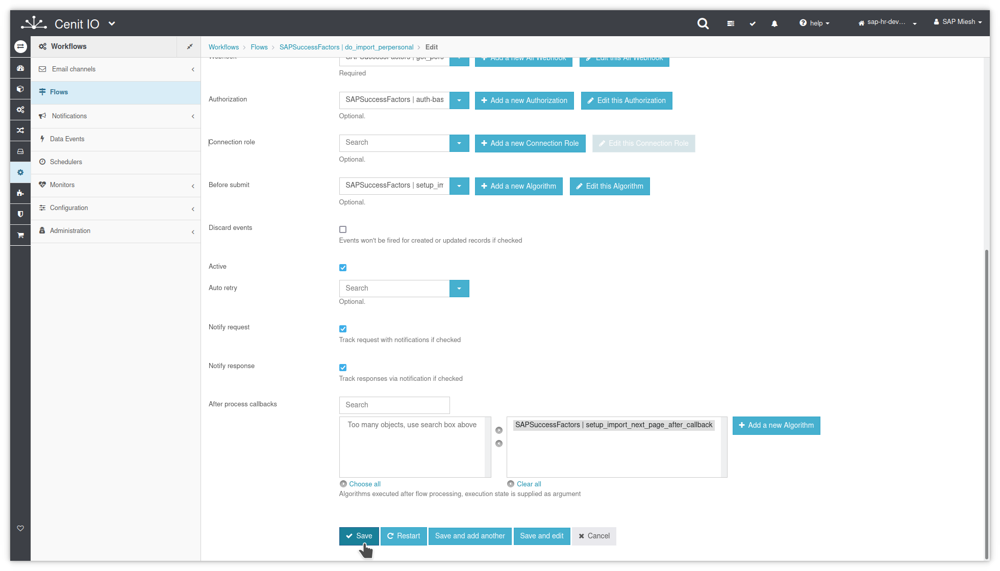
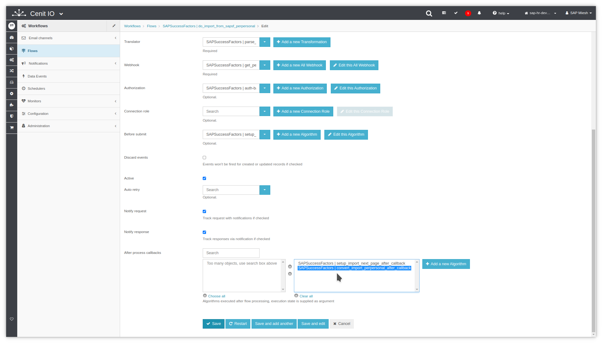
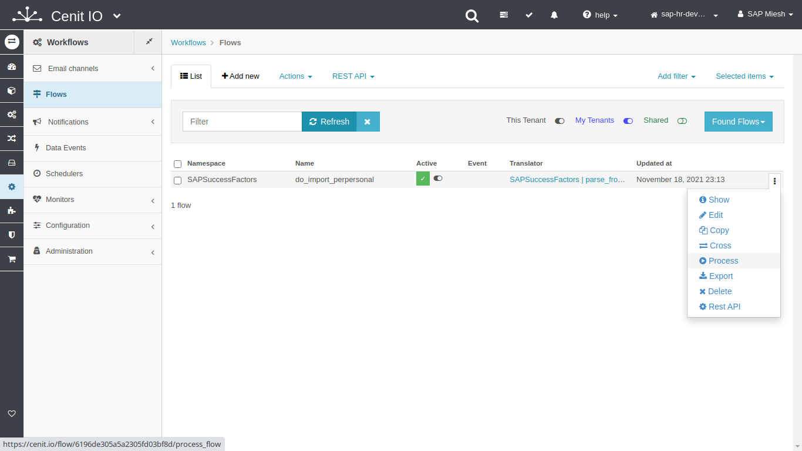
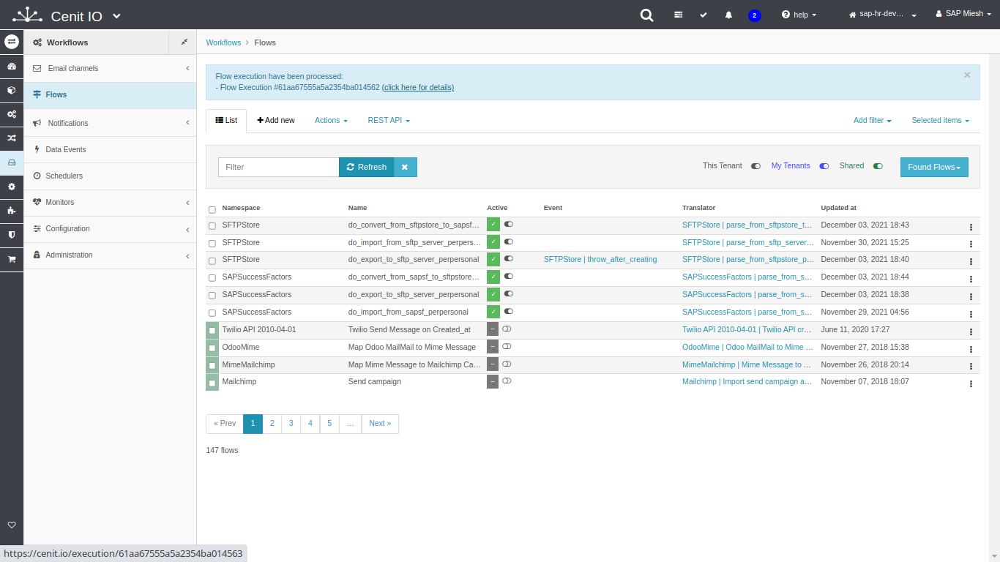
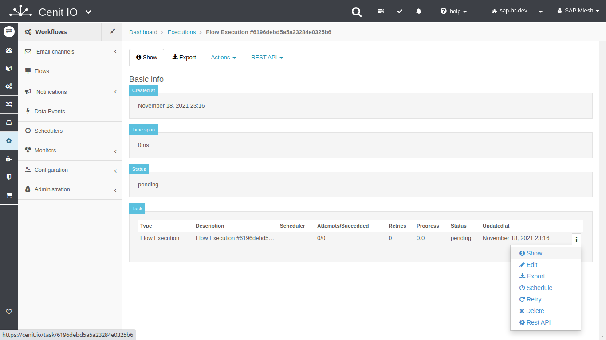
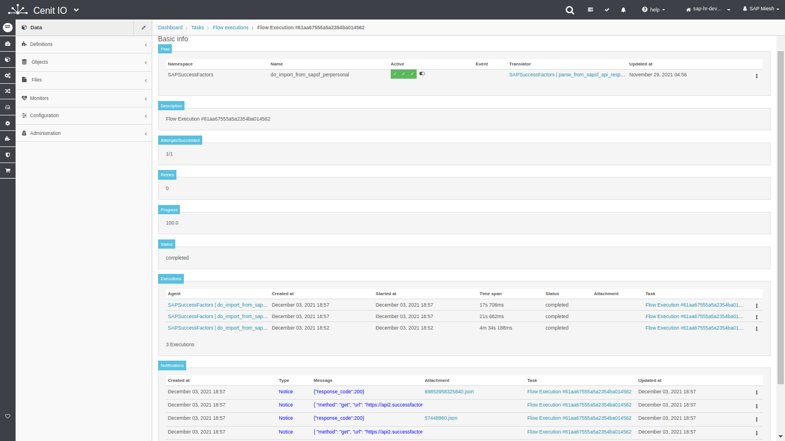
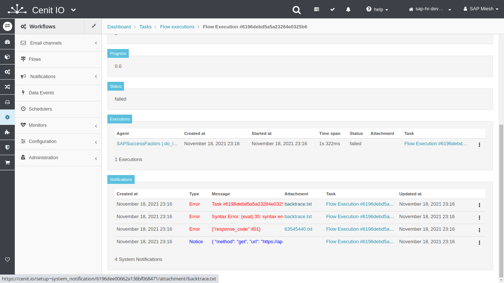

# Create flow to import PerPersonal from SAPSuccessFactors

## Requirements

* SAPSuccessFactors [authorization](../authorizations/sap-success-factors.md)
* SAPSuccessFactors [webhook](../webhooks/sap-success-factors-get-perpersonal.md)
* SAPSuccessFactors [translator](../translators/parse_from_sapsf_api_response_to_sapsf_perpersonal.md)
* SAPSuccessFactors [before-submit](../algorithms/sapsf-setup_import_before_submit.md)
* SAPSuccessFactors [after-callback](../algorithms/sapsf-setup_import_next_page_after_callback.md)
* Sign in at CenitIO.[<i class="fa fa-external-link" aria-hidden="true"></i>](https://cenit.io/users/sign_in)

## Creating flow

* Goto [flows](https://cenit.io/flow) module.
* Select the action [add new](https://cenit.io/flow/new) to create the new flow.
* Complete the fields of the form with the following information or those corresponding to your business:

<!-- tabs:start -->

#### **Scenario 01: Simple**

    >- **Namespace**: SAPSuccessFactors
    >- **Name**: do_import_from_sapsf_perpersonal
    >- **Description**: Imports the records of the PerPersonal entity from SAP SuccessFactors and stores them transformed in cenit.
    >- **Translator**: SAPSuccessFactors | parse_from_sapsf_to_cenit_perpersonal
    >- **Webhook**: SAPSuccessFactors | get_personal_information
    >- **Authorization**: SAPSuccessFactors | auth-basic
    >- **Before submit**: SAPSuccessFactors | setup_import_before_submit
    >- **After process callbacks**: 
    >   - [SAPSuccessFactors | setup_import_next_page_after_callback](../algorithms/sapsf-setup_import_next_page_after_callback.md)
    >- **Active**: true
    >- **Notify request**: true
    >- **Notify response**: true

#### **Scenario 02: Connected with convert flow**

    >- **Namespace**: SAPSuccessFactors
    >- **Name**: do_import_from_sapsf_perpersonal
    >- **Description**: Imports the records of the PerPersonal entity from SAP SuccessFactors and stores them transformed in cenit.
    >- **Translator**: SAPSuccessFactors | parse_from_sapsf_to_cenit_perpersonal
    >- **Webhook**: SAPSuccessFactors | get_personal_information
    >- **Authorization**: SAPSuccessFactors | auth-basic
    >- **Before submit**: SAPSuccessFactors | setup_import_before_submit
    >- **After process callbacks**: 
    >   - [SAPSuccessFactors | setup_import_next_page_after_callback](../algorithms/sapsf-setup_import_next_page_after_callback.md)
    >   - [SAPSuccessFactors | convert_import_perpersonal_after_callback](../algorithms/sapsf-convert_import_perpersonal_after_callback.md)
    >- **Active**: true
    >- **Notify request**: true
    >- **Notify response**: true
    
<!-- tabs:end -->

> **Note**: For the name of the flow, the following format is recommended **do_\{*flow_type*\}\_from\_\{*origin*\}**

## Snapshots of the process

### Goto flow module

   
   
    
### Add new flow

   
   
   
   
### Test flow (process)

   
   
   
   
   
