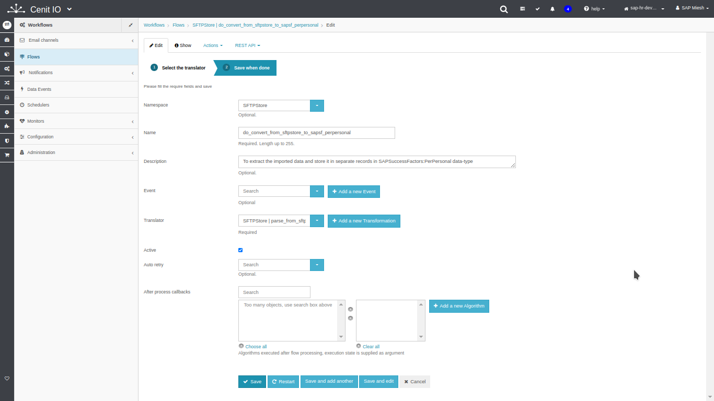
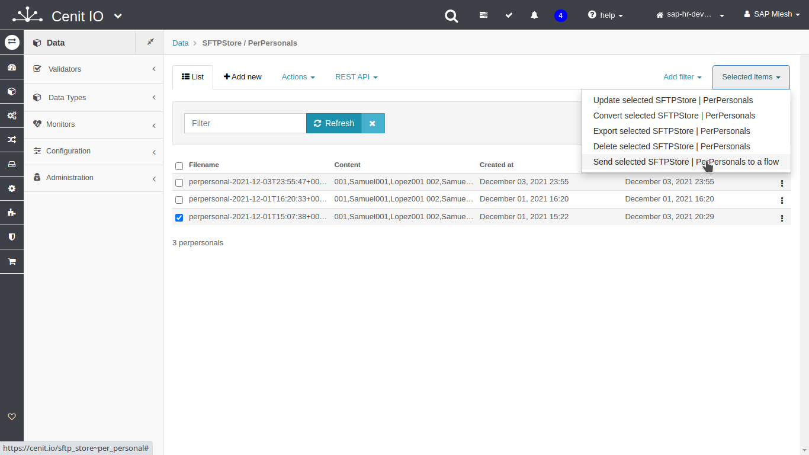

# Create a flow to convert PerPersonal single consolidated record to separate records

## Requirements

* SFTPStore [translator](translators/parse_from_sftpstore_to_sapsf_perpersonal.md)
* Sign in at CenitIO.[<i class="fa fa-external-link" aria-hidden="true"></i>](https://cenit.io/users/sign_in)

## Creating flow

* Goto [flows](https://cenit.io/flow) module.
* Select the action [add new](https://cenit.io/flow/new) to create the new flow.
* Complete the fields of the form with the following information or those corresponding to your business:

    >- **Namespace**: SFTPStore
    >- **Name**: do_convert_from_sftpstore_to_sapsf_perpersonal
    >- **Description**: To extract the imported data and store it in separate records in SAPSuccessFactors:PerPersonal data-type.
    >- **Translator**: [SFTPStore | parse_from_sftpstore_to_sapsf_perpersonal](translators/parse_from_sftpstore_to_sapsf_perpersonal.md)
    >- **Active**: true

    > **Note**: For the convert flow name, the following format is recommended **do_convert_from_\{*origin*\}_to\_{*destination*\}**

## Snapshots of the process

### Goto flow module

   
   
    
### Add new flow

   
   
### Test flow (process)

   
   
   
   
   
   
