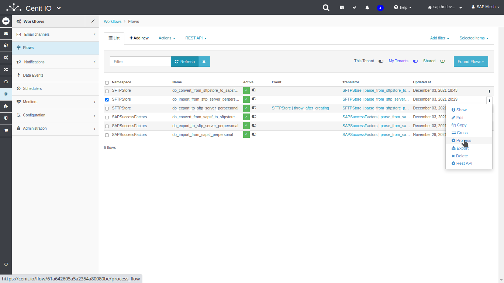

# Create flow to import PerPersonal from SFTP-Server

## Requirements

* SFTPStore [authorization](authorizations/sftp-store.md)
* SFTPStore [webhook](webhooks/sftp-store-download-file.md)
* SFTPStore [translator](translators/parse_from_sftp_server_download_response_to_sftpstore_perpersonal.md)
* SFTPStore [before-submit](algorithms/sftpstore-setup_import_before_submit.md)
* Sign in at CenitIO.[<i class="fa fa-external-link" aria-hidden="true"></i>](https://cenit.io/users/sign_in)

## Creating flow

* Goto [flows](https://cenit.io/flow) module.
* Select the action [add new](https://cenit.io/flow/new) to create the new flow.
* Complete the fields of the form with the following information or those corresponding to your business:

    >- **Namespace**: SFTPStore
    >- **Name**: do_import_from_sftp_server_perpersonal
    >- **Description**: Import the file with PerPersonal data from SFTP server
    >- **Translator**: [SFTPStore | parse_from_sftp_server_response_to_sftpstore_perpersonal](translators/parse_from_sftp_server_download_response_to_sftpstore_perpersonal.md)
    >- **Webhook**: [SFTPStore | download_file](webhooks/sftp-store-download-file.md)
    >- **Authorization**: [SFTPStore | auth-basic](authorizations/sftp-store.md)
    >- **Before submit**: 
    >   - [SFTPStore | setup_import_before_submit](algorithms/sftpstore-setup_import_before_submit)
    >- **Active**: true
    >- **Notify request**: true
    >- **Notify response**: true

    > **Note**: For the name of the import flow, the following format is recommended **do_import_from\_\{*origin*\}**

## Snapshots of the process

### Goto flow module

   
   
    
### Add new flow

   

### Test flow (process)

   
   
   
   
   
