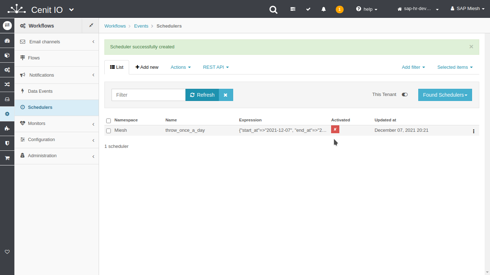

# Create the scheduler to start the excecution once a day

## Requirements

* Sign in at CenitIO.[<i class="fa fa-external-link" aria-hidden="true"></i>](https://cenit.io/users/sign_in)

## Creating scheduler event

* Goto [schedulers](https://cenit.io/scheduler) module.
* Select the action [add new](https://cenit.io/scheduler/new) to create the new scheduler.
* Complete the fields of the form with the following information or those corresponding to your business:

    >- **Namespace**: Miesh
    >- **Name**: throw_once_a_day
    >- **Scheduling type**: Start = Repeat= End=
    >- **Scheduling type**: Start = Repeat= End=
    >- **Scheduling type**: Start = Repeat= End=

## Snapshots of the process

### Goto schedulers module

   
   
    
### Add new scheduler

   
   

### Activate scheduler

   
   
   