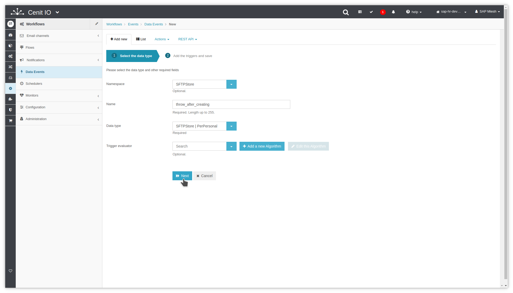
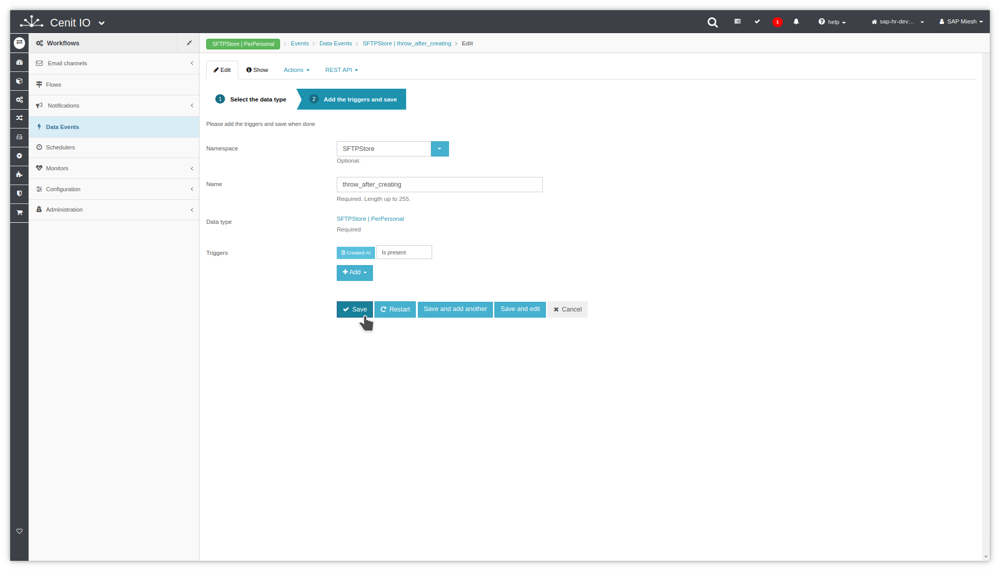

# Create the schedule to start the excecution once a day

## Requirements

* SAPSuccessFactors [convert flow](flows/do_convert_from_sapsf_to_sftpstore_perpersonal.md)
* Sign in at CenitIO.[<i class="fa fa-external-link" aria-hidden="true"></i>](https://cenit.io/users/sign_in)

## Creating schedule event

* Goto [schedulers](https://cenit.io/scheduler) module.
* Select the action [add new](https://cenit.io/scheduler/new) to create the new schedule.
* Complete the fields of the form with the following information or those corresponding to your business:

    >- **Namespace**: SAPSuccessFactors
    >- **Name**: throw_once_day
    >- **Scheduling type**: Start = Repeat= End=

## Snapshots of the process

### Goto data-type module

   
   
    
### Add new data-type

   
   
   

