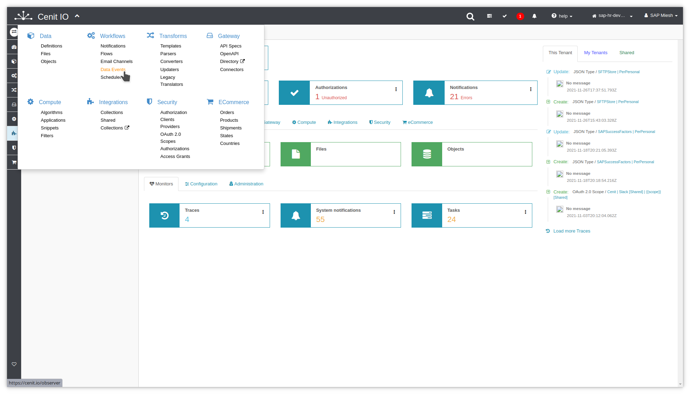
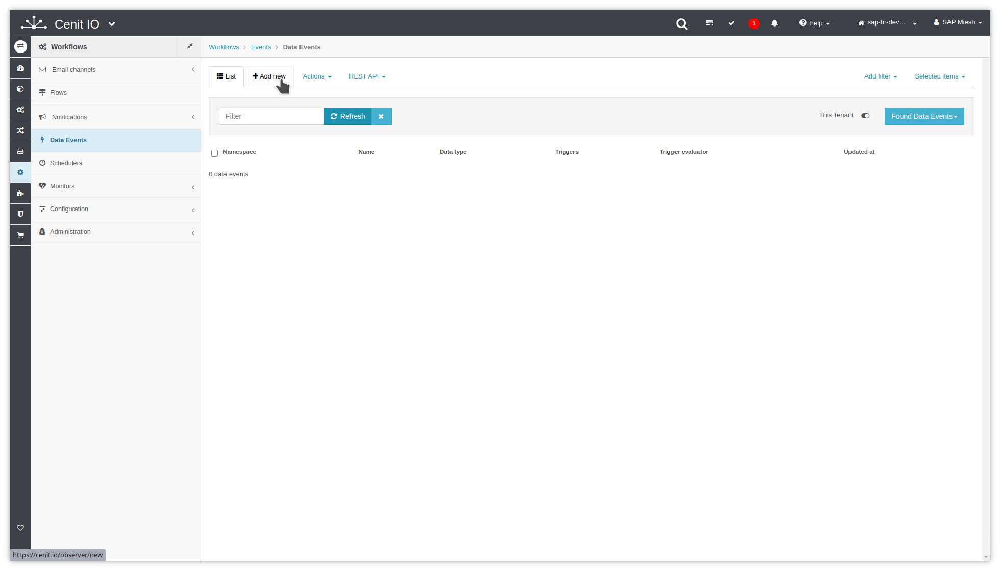
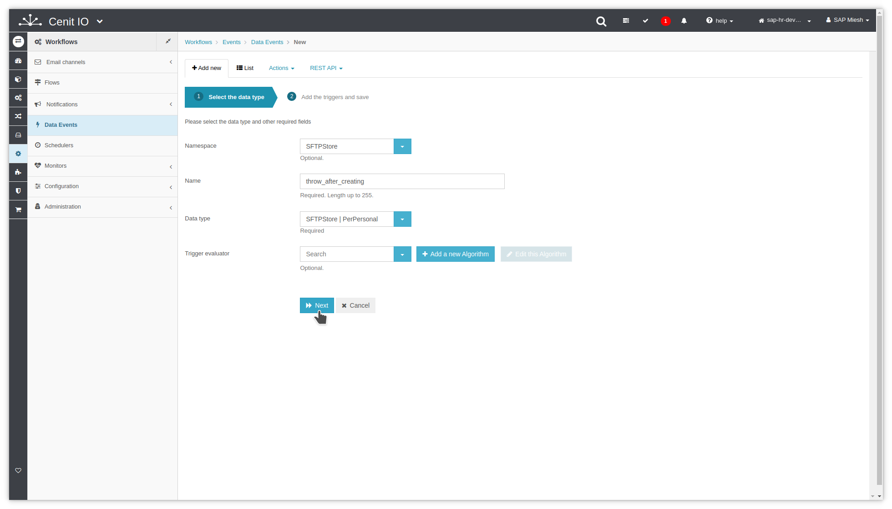
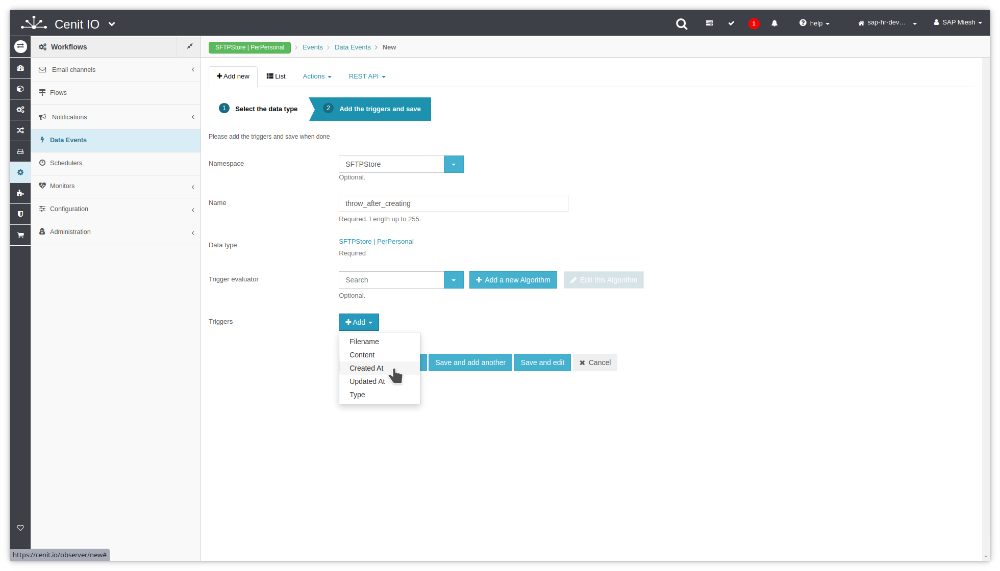
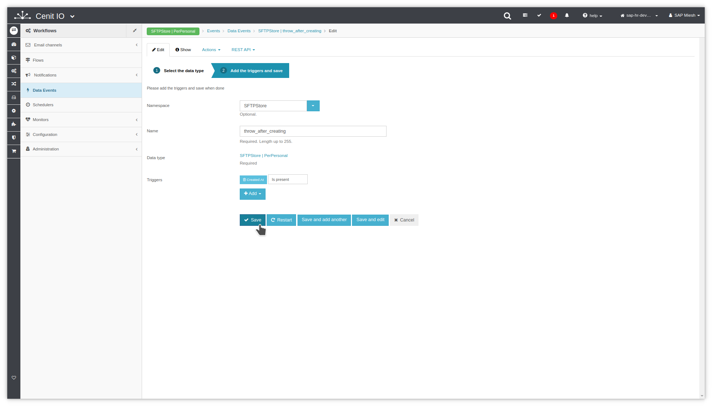

# Create SFTPStore PerPersonal data-event

## Requirements

* SFTPStore [data-type](data-types/SFTPStore-PerPersonal.md)
* Sign in at CenitIO.[<i class="fa fa-external-link" aria-hidden="true"></i>](https://cenit.io/users/sign_in)

## Creating data-event

* Goto [data-events](https://cenit.io/observer) module.
* Select the action [add new](https://cenit.io/observer/new) to create the new data-event.
* Complete the fields of the form with the following information or those corresponding to your business:

    >- **Namespace**: SFTPStore
    >- **Name**: throw_after_creating
    >- **Data type**: SFTPStore | PerPersonal
    >- **Triggers**: Created At | Is present

## Snapshots of the process

### Goto data-type module

   
   
    
### Add new data-type

   
   
   

