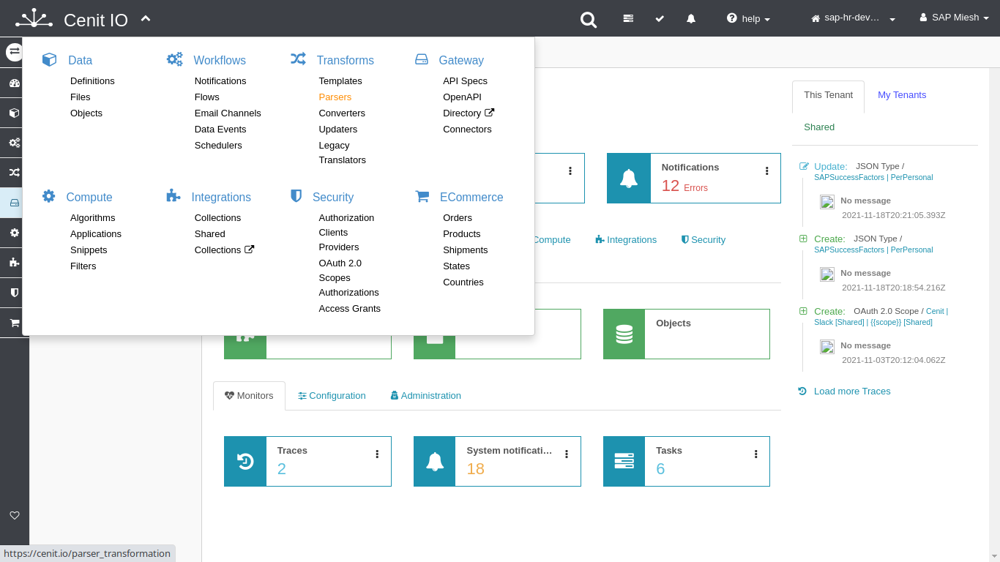
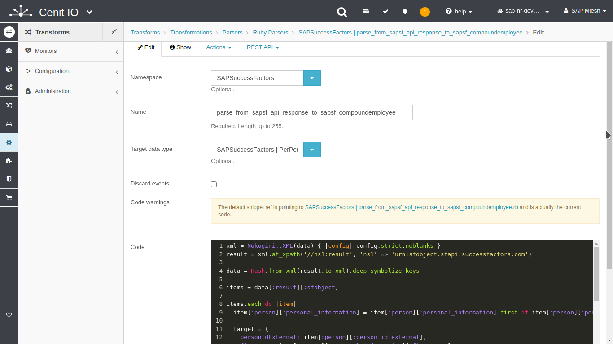

# Create parser-translator for CompoundEmployees api response

## Requirements

* SAPSuccessFactors [source-data-type](data-types/SAPSuccessFactors-CompoundEmployees.md)
* Review the SAPSuccessFactors Employee Central CompoundEmployee API specification.[<i class="fa fa-external-link" aria-hidden="true"></i>](https://help.sap.com/viewer/d599f15995d348a1b45ba5603e2aba9b/2111/en-US/5c8bca0af1654b05a83193b2922dcee2.html)
* The resource schema in the API-Service response.
* Sign in at CenitIO.[<i class="fa fa-external-link" aria-hidden="true"></i>](https://cenit.io/users/sign_in)

## Creating translator of parser type

* Goto [translators](https://cenit.io/parser_transformation) module.
* Select the action [add new](https://cenit.io/parser_transformation/new) to create the new translator of parser type.
* Complete the fields of the form with the following information or those corresponding to your business:

    >- **Namespace**: SAPSuccessFactors
    >- **Name**: parse_from_sapsf_api_response_to_sapsf_compoundemployees
    >- **Target data type**: [SAPSuccessFactors | CompoundEmployees](data-types/SAPSuccessFactors-CompoundEmployees.md)
    >- **Code**: the code snippet of parser in Ruby language

    > **Note**: For the name of the translator, the following format is recommended **parse_from\_\{*origin*\}\_to\_\{*destination*\}**

## Code snippet
```ruby
xml = Nokogiri::XML(data) { |config| config.strict.noblanks }
result = xml.at_xpath('//ns1:result', 'ns1' => 'urn:sfobject.sfapi.successfactors.com')

data = Hash.from_xml(result.to_xml).deep_symbolize_keys

data[:result][:sfobject].each do |item|
  target = {
    personIdExternal: item[:person][:person_id_external],
    firstName: item[:person][:personal_information][:first_name],
    lastName: item[:person][:personal_information][:last_name],
    rawData: item
  }

  target_data_type.create_from_json!(target, primary_field: [:personIdExternal])
end
```
## Snapshots of the process

### Goto translator module

   
    
### Add new translator

   
   
