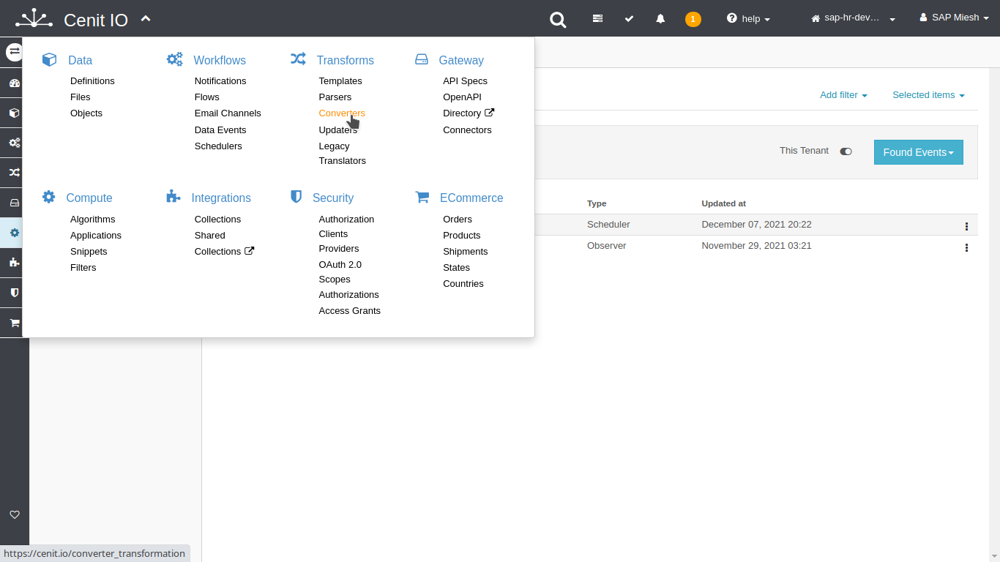

# Create convert-translator for CompoundEmployee

## Requirements

* SAPSuccessFactors [source-data-type](data-types/SAPSuccessFactors-CompoundEmployee.md)
* SFTPStore [target-data-type](data-types/SFTPStore-PerPersonal.md)
* Sign in at CenitIO.[<i class="fa fa-external-link" aria-hidden="true"></i>](https://cenit.io/users/sign_in)

## Creating translator of converter type

* Goto [translators](https://cenit.io/ruby_converter) module.
* Select the action [add new](https://cenit.io/ruby_converter/new) to create the new translator of convert type.
* Complete the fields of the form with the following information or those corresponding to your business:

    >- **Namespace**: SAPSuccessFactors
    >- **Name**: parse_from_sapsf_compoundemployee_to_sftpstore_perpersonal
    >- **Source data type**: [SAPSuccessFactors | CompoundEmployee](data-types/SAPSuccessFactors-CompoundEmployee.md)
    >- **Target data type**: [SFTPStore | PerPersonal](data-types/SFTPStore-PerPersonal.md)
    >- **Source handler**: true
    >- **Code**: the code snippet of converter in Ruby language

    > **Note**: For the name of the translator, the following format is recommended **parse_from\_\{*origin*\}\_to\_\{*destination*\}**

## Code snippet

```ruby
content = '';

sources.each do |item|
  # Add and customize the row of csv file  
  content << item.personIdExternal << ','
  content << item.firstName << ',' 
  content << item.lastName << "\n"
end

date = DateTime.now.iso8601
target_data = { filename:  "perpersonal-#{date}.csv", content: content }

target_data_type.create_from_json!(target_data, primary_field: [:filename])
```

## Snapshots of the process

### Goto translator module

   
    
### Add new translator

   
