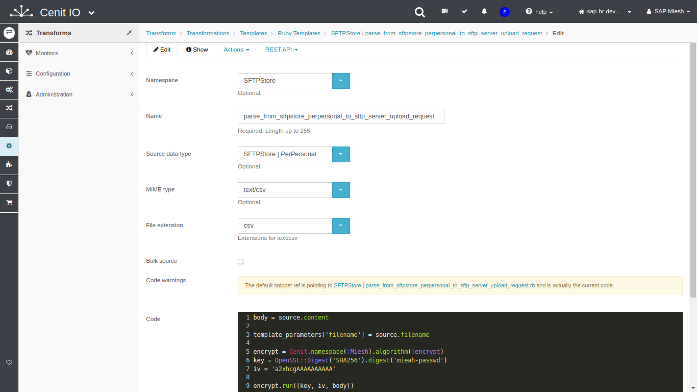

# Create template-translator for upload the consolidated PerPersonal record to SFTP Server file

## Requirements

* SFTPStore [source-data-type](data-types/SFTPStore-PerPersonal.md)
* Algorithm to encrypt data.[<i class="fa fa-external-link" aria-hidden="true"></i>](algorithms/miesh-encrypt.md)
* Sign in at CenitIO.[<i class="fa fa-external-link" aria-hidden="true"></i>](https://cenit.io/users/sign_in)

## Creating translator of template type

* Goto [translators](https://cenit.io/template) module.
* Select the action [add new](https://cenit.io/template/new) to create the new translator of template type.
* Complete the fields of the form with the following information or those corresponding to your business:

    >- **Namespace**: SFTPStore
    >- **Name**: parse_from_sftpstore_perpersonal_to_sftp_server_upload_request
    >- **Source data type**: [SFTPStore | PerPersonal](data-types/SFTPStore-PerPersonal.md)
    >- **MIME type**: text/csv
    >- **File extension**: csv
    >- **Bulk source**: false
    >- **Code**: the code snippet of template in Ruby language to prepare raw o encrypt file.

    > **Note**: For the name of the translator, the following format is recommended **parse_from\_\{*origin*\}\_to\_\{*destination*\}**

## Code snippet to upload file

<!-- tabs:start -->

#### **Raw file**

```ruby
body = source.content

template_parameters['filename'] = source.filename

body
```

#### **Encrypted file**

```ruby
body = source.content

template_parameters['filename'] = source.filename

encrypt = Cenit.namespace(:Miesh).algorithm(:encrypt)
key = OpenSSL::Digest('SHA256').digest('mieah-passwd')
iv = 'a2xhcgAAAAAAAAAA'

encrypt.run([key, iv, body])
```

<!-- tabs:end -->

## Snapshots of the process

### Goto translator module

   
    
### Add new translator

   
   
