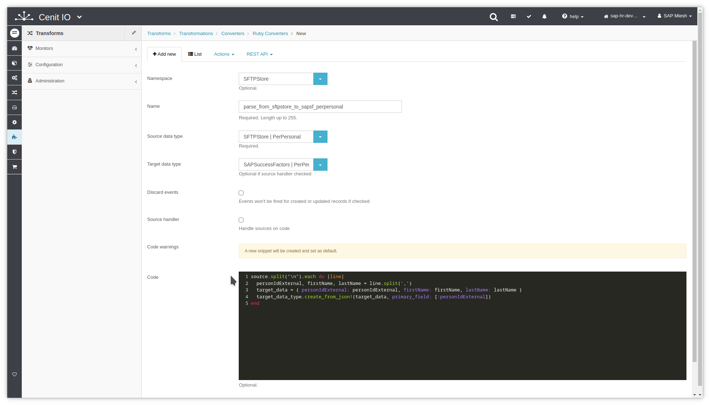

# Create convert-translator for PerPersonal

## Requirements

* SFTPStore [source-data-type](../data-types/SAPSuccessFactors-PerPersonal.md)
* SAPSuccessFactors [target-data-type](../data-types/SAPSuccessFactors-PerPersonal.md)
* Sign in at CenitIO.[<i class="fa fa-external-link" aria-hidden="true"></i>](https://cenit.io/users/sign_in)

## Creating convert-translator

* Goto [translators](https://cenit.io/ruby_converter) module.
* Select the action [add new](https://cenit.io/ruby_converter/new) to create the new translator of convert type.
* Complete the fields of the form with the following information or those corresponding to your business:

    >- **Namespace**: SFTPStore
    >- **Name**: parse_from_sftpstore_to_sapsf_perpersonal
    >- **Source data type**: SFTPStore | PerPersonal
    >- **Target data type**: SAPSuccessFactors | PerPersonal
    >- **Code**: the code snippet of converter in Ruby language

    > **Note**: For the name of the translator, the following format is recommended **parse_from\_\{*origin*\}\_to\_\{*destination*\}**

## Code snippet

```ruby
source.content.strip.split("\n").each do |line|
  personIdExternal, firstName, lastName = line.split(',')
  target_data = { personIdExternal: personIdExternal, firstName: firstName, lastName: lastName }
  target_data_type.create_from_json!(target_data, primary_field: [:personIdExternal])
end
```

## Snapshots of the process

### Goto translator module

   
    
### Add new translator

   
   
