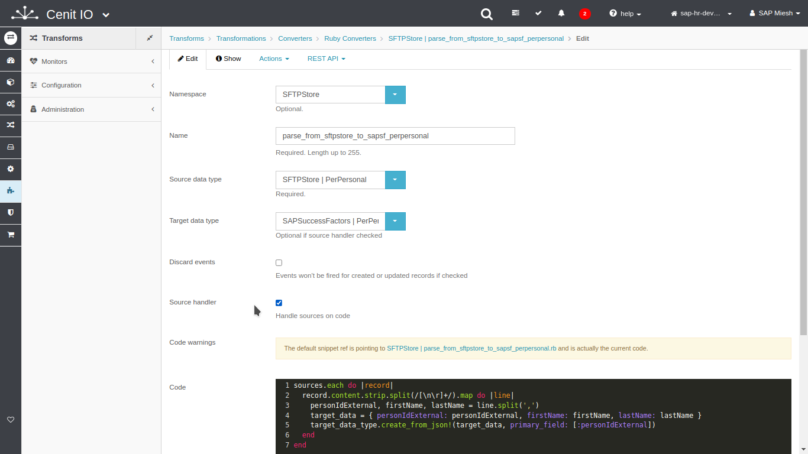

# Create SFTP-Store translators to upload file

## Requirements

* SAP-SuccessFactors [data-type](../data-types/sap-success-factors-perpersonal.md)
* Format and structure of the file to upload.
* Algorithm to encrypt data.[<i class="fa fa-external-link" aria-hidden="true"></i>](../algorithms/miesh-encrypt.md)
* Sign in at CenitIO.[<i class="fa fa-external-link" aria-hidden="true"></i>](https://cenit.io/users/sign_in)

## Creating translator of template type

* Goto [translators](https://cenit.io/template) module.
* Select the action [add new](https://cenit.io/template/new) to create the new translator of template type.
* Complete the fields of the form with the following information or those corresponding to your business:

    >- **Namespace**: SFTPStore
    >- **Name**: parse_from_cenit_perpersonal_to_sftp_csv
    >- **Source data type**: SAPSuccessFactors | PerPersonal
    >- **MIME type**: text/csv
    >- **File extension**: csv
    >- **Bulk source**: true
    >- **Code**: the code snippet of template in Ruby language to prepare raw o encrypt file.

    > **Note**: For the name of the translator, the following format is recommended **parse_from\_\{*origin*\}\_to\_\{*destination*\}\_\{*resource*\}**

## Code snippet to upload raw file

```Ruby
body = ''

sources.each do |item| 
  body << item.personIdExternal << ','
  body << item.firstName << ',' 
  body << item.lastName << "\n"
end  

template_parameters['filename'] = "perpersonal-#{DateTime.now.iso8601}.csv"

body
```

## Code snippet to upload encrypted file

```Ruby
body = ''

sources.each do |item| 
  body << item.personIdExternal << ','
  body << item.firstName << ',' 
  body << item.lastName << "\n"
end  

template_parameters['filename'] = "perpersonal-#{DateTime.now.iso8601}-encrypt.csv"

encrypt = Cenit.namespace(:Miesh).algorithm(:encrypt)
key = OpenSSL::Digest('SHA256').digest('mieah-passwd')
iv = 'a2xhcgAAAAAAAAAA'

encrypt.run([key, iv, body])
```

## Snapshots of the process

### Goto translator module

   
    
### Add new translator

   
   
