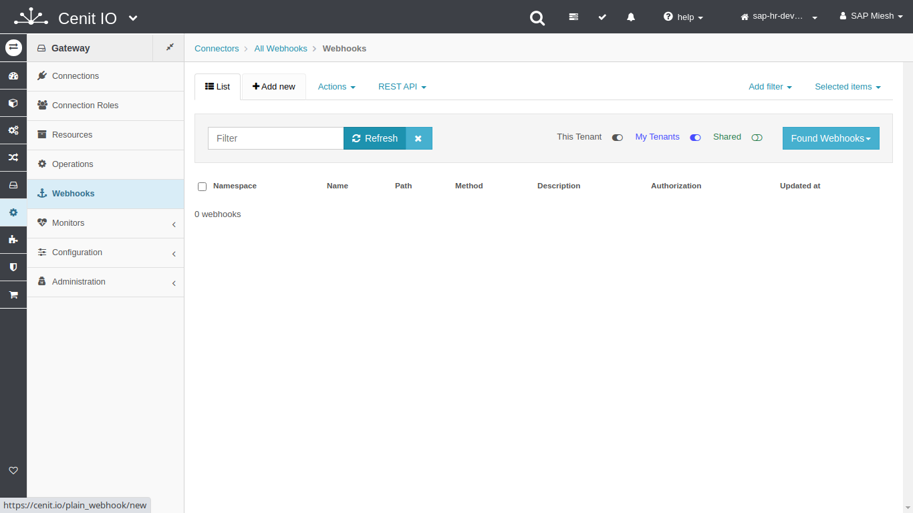

# Create a webhook to upload a file to an SFTP-Server

## Requirements

* SFTPStore [connection](../connections/SFTPStore-connection.md)
* The resource-path, http-method and parameters to upload file to the SFTP-Server..
* Sign in at CenitIO.[<i class="fa fa-external-link" aria-hidden="true"></i>](https://cenit.io/users/sign_in)

## Creating webhook

* Goto [webhooks](https://cenit.io/plain_webhook) module.
* Select the action [add new](https://cenit.io/plain_webhook/new) to create the new webhook.
* Complete the fields of the form with the following information or those corresponding to your business:

    >- **Namespace**: SFTPStore
    >- **Name**: upload_file
    >- **Path**: miesh/{{filename}}
    >- **Method**: put
    >- **Description**: Upload file to SFTP-Server
    >- **Template Parameters**: filename

    > **Note**: For the name of the webhook, the following format is recommended **{*webhook_action*}\_{*webhook_noun*}**

## Snapshots of the process

### Goto webhook module

   
    
### Add new webhook

   
   
