# Create SAPSuccessFactors webhooks

## Requirements

* SAPSuccessFactors [connection](../connections/sap-success-factors.md)
* Review the SAPSuccessFactors API specification.[<i class="fa fa-external-link" aria-hidden="true"></i>](https://help.sap.com/viewer/d599f15995d348a1b45ba5603e2aba9b/2111/en-US/5c8bca0af1654b05a83193b2922dcee2.html)
* The resource-path, http-method and parameters of the API-Service.
* Sign in at CenitIO.[<i class="fa fa-external-link" aria-hidden="true"></i>](https://cenit.io/users/sign_in)

## Creating webhook

* Goto [webhooks](https://cenit.io/plain_webhook) module.
* Select the action [add new](https://cenit.io/plain_webhook/new) to create the new webhook.
* Complete the fields of the form with the following information or those corresponding to your business:

    >- **Namespace**: SAPSuccessFactors
    >- **Name**: get_personal_information
    >- **Path**: PerPersonal
    >- **Method**: get
    >- **Description**: Query Personal Information
    >- **Parameters**: customPageSize = {{limit}}, $skiptoken = {{skiptoken}}
    >- **Template Parameters**: limit = 200, skiptoken

    > **Note**: For the name of the webhook, the following format is recommended **{*webhook_action*}\_{*webhook_noun*}**

## Snapshots of the process

### Goto webhook module

   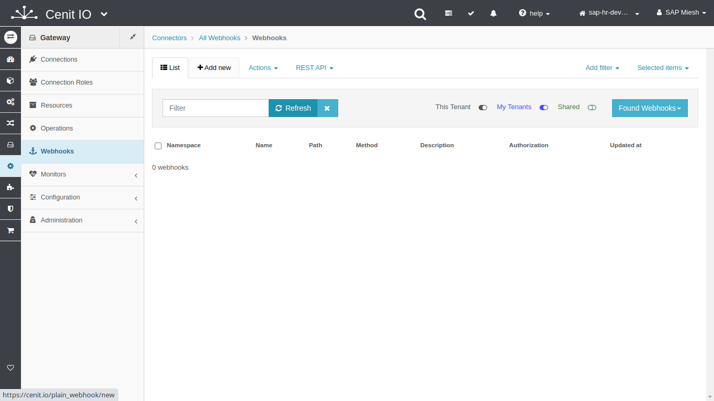
    
### Add new webhook

   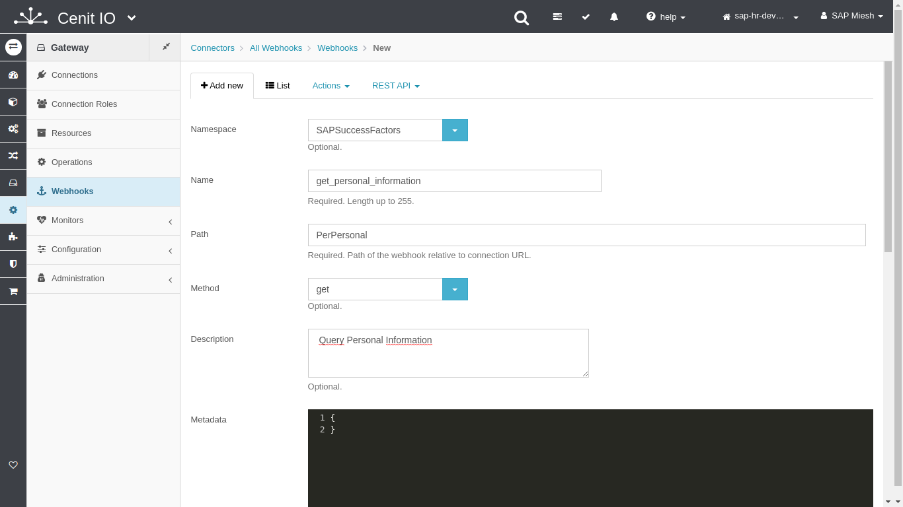
   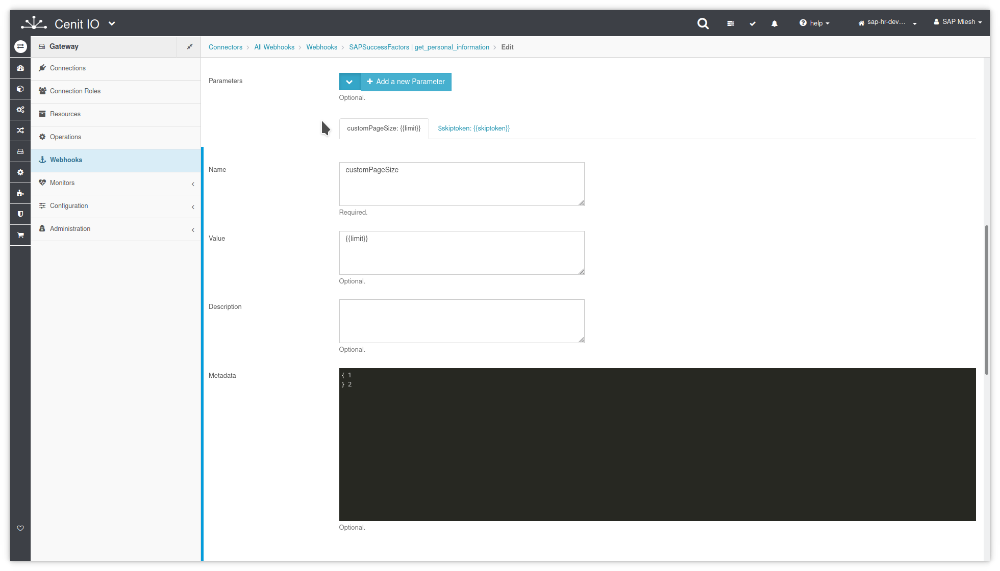
   
   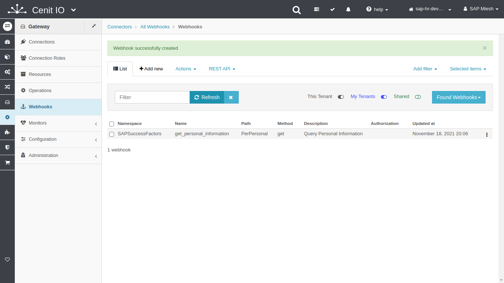
   
### Test webhook (submit)

   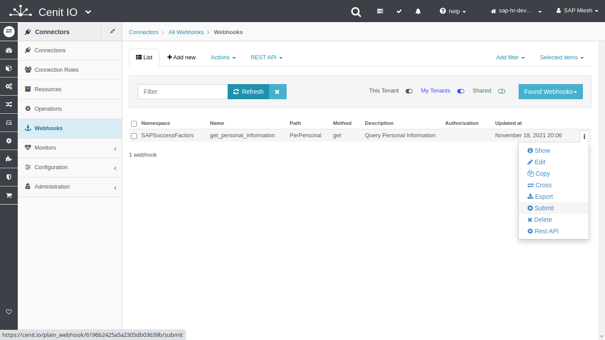
   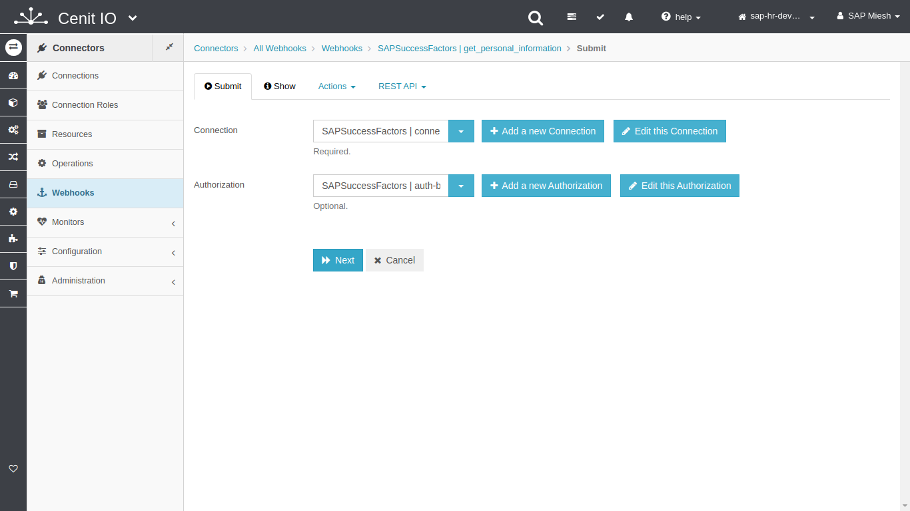
   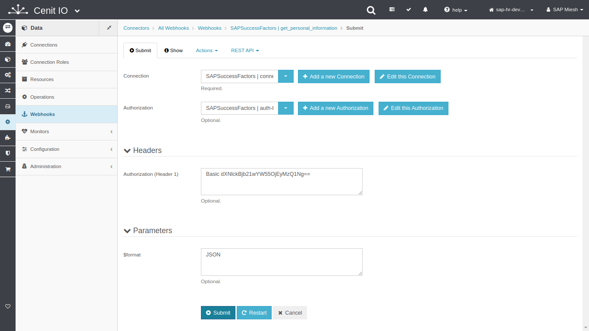
   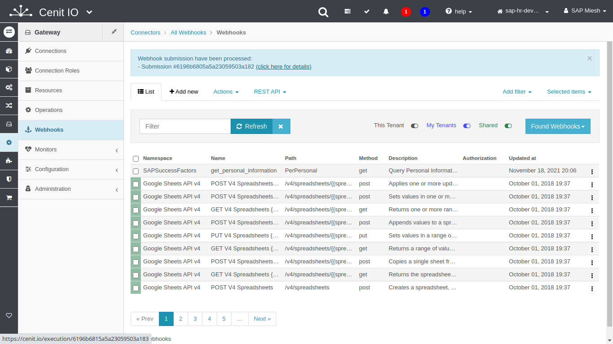
   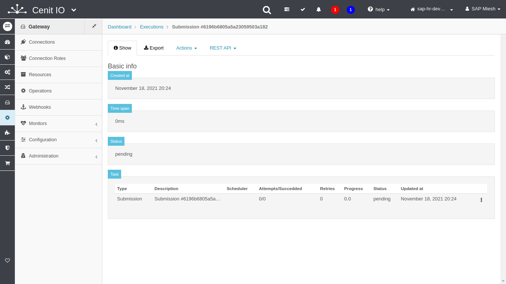
   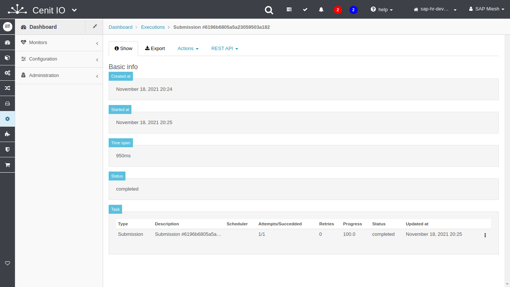
   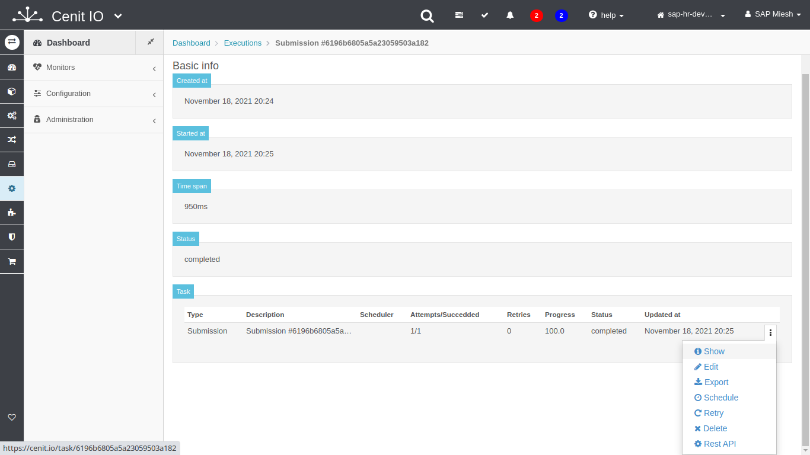
   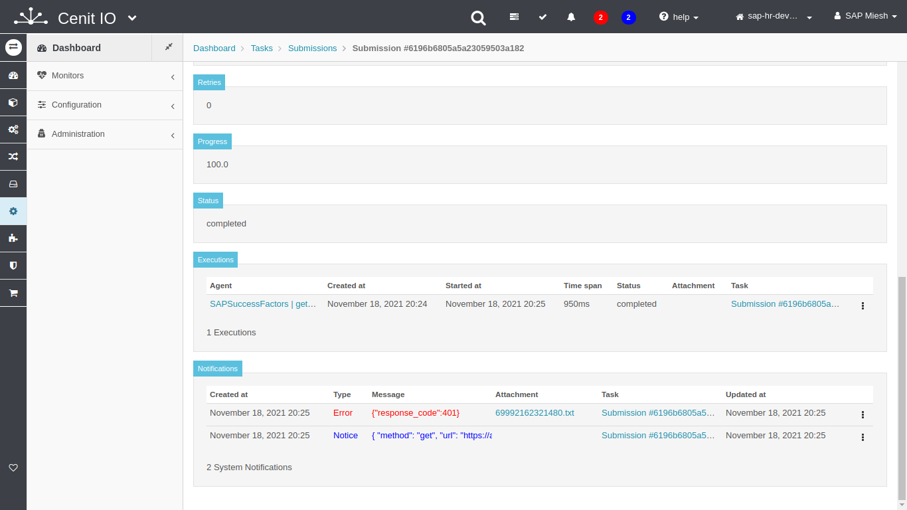
