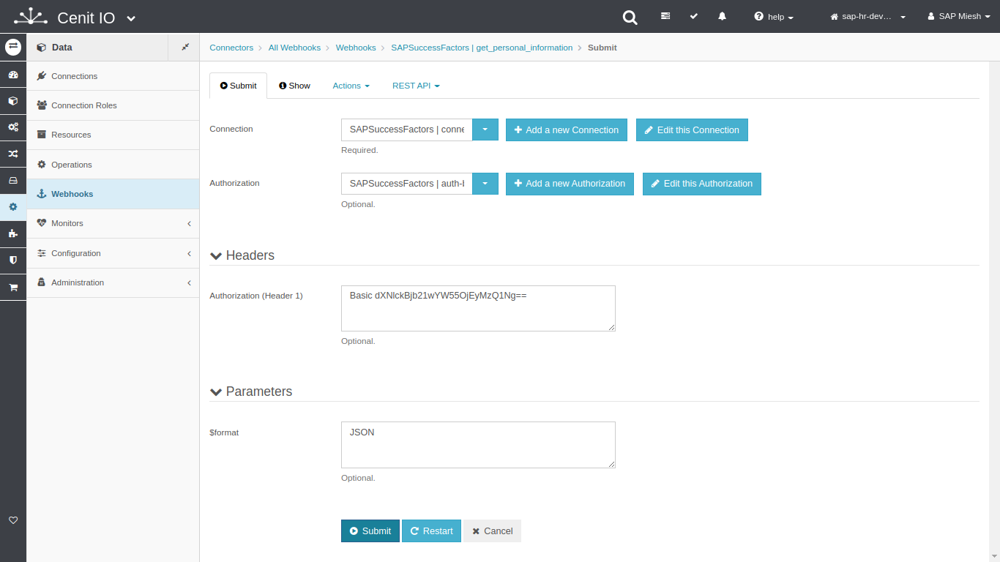
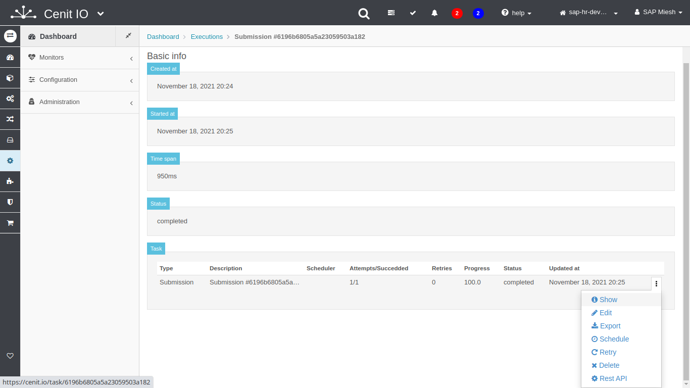

# Create SAP-SuccessFactors webhooks in CenitIO

## Requirements

* SAP-SuccessFactors [connection](../connections/sap-success-factors.md)
* Review the SAP-SuccessFactors API specification.[<i class="fa fa-external-link" aria-hidden="true"></i>](https://help.sap.com/viewer/368c481cd6954bdfa5d0435479fd4eaf/Cloud/en-US/bd2fbd5133e8411b8e3608fceb28a608.html)
* The resource-path, http-method and parameters of the API-Service.
* Sign in at CenitIO.[<i class="fa fa-external-link" aria-hidden="true"></i>](https://cenit.io/users/sign_in)

## Creating webhook

* Goto [webhooks](https://cenit.io/plain_webhook) module.
* Select the action [add new](https://cenit.io/plain_webhook/new) to create the new webhook.
* Complete the fields of the form with the following information or those corresponding to your business:

    >- **Namespace**: SAPSuccessFactors
    >- **Name**: get_personal_information
    >- **Path**: PerPersonal
    >- **Method**: get
    >- **Description**: Query Personal Information

## Snapshots of the process

### Goto webhook module

   
    
### Add new webhook

   
   
   
### Test webhook (submit)

   
   
   
   
   
   
   
   
